# PR 评审循环的有穷性：人类工程惯例的机制解剖，与成品 agent harness 内的可执行协议

> 基准日 **2026-08-04** ｜ 一手数据 **2,997 个不同 PR / 102 次 GraphQL 调用** ｜ 图 **16 张** ｜ 可复算表 **11 张** ｜ 机器核对断言 **195 条**（`python3 scripts/verify.py`）｜ 参考文献 **34 条**（全文核对文献 **22 篇**，其中 **6 条引用因未能在原文定位而撤销**）

---

## 摘要

在 pull request / merge request 驱动的开发模式中，「作者提交 → 评审者提意见 → 作者修改 → 评审者再提意见」构成一个反馈循环。该循环没有任何内生的终止保证：评审算子在每一轮都可以生成新的意见元素，而「代码质量达标」这一谓词既无法形式化定义也无法机械判定。本报告的立论是：**成熟工程组织从未试图通过「改到没有意见」来终止这个循环，而是承认该谓词不可判定，转而从外部强加四类结构性约束把循环掐断**——语义降级、时钟、仲裁、以及把剩余分歧移出本 PR。

我们把这个论断拆成两半来验证。人类侧，我们在 2026-08-04 实测了 5 个成熟仓库最近 100 个已合并 PR（D1，n=500）与最近 100 个关闭未合并 PR（D2，n=500）、4 个仓库 2026-02-01 以来的 revert 比例（D4，13,205 个已合并 PR），并逐事件还原了一个 112 天的真实 PR 全流程。结果：**97.8% 的已合并 PR 从未出现过一次正式的阻塞态**，review 提交数中位为 1；而未能合并的一侧，中位开放 7.0 天、p90 达 316.6 天、**51.2% 从未被 review 过**、22.4% 带有 stale 类标签。也就是说，现实世界中「循环不收敛」的终止方式主要是**超时与放弃**，而非收敛；正式的阻塞态是稀有事件，被保留给真正的原则性分歧。

agent 侧，我们抓取了 4 个可按作者身份检索的 coding agent 的 1,600 个已合并 PR（D3，覆盖 432 个仓库）与 50 个成熟仓库 agent PR 上的 259 条 review 正文（D7），并逐事件还原了一个由 agent 撰写、AI reviewer 全程空转、最终由人类仲裁终止的真实 PR。两个必须写在前面的**自我修正**：其一，本项目早期基于 n=16 的小样本曾断言「成熟仓库对 agent PR 零漏检、审查强度为人类 PR 的 3–10 倍」，扩样至 n=78 后该断言**被推翻**；其二，扩样后的成熟层比率又被发现由**单一仓库主导**（23 个「零关注」PR 中 20 个来自同一仓库），留一仓库刀切后该层比率从 29.5% 落到 5.4%，因此**按 PR 计数的跨层比较在成熟层不成立**，我们改用仓库级宏平均与刀切区间报告。稳健留下的结论只有一条：小仓库层（n=1,522，408 个仓库，最大仓库占比 3.68%，刀切区间 20.9%–22.9%）中 agent PR 的「零 review 且零评论」比率约为人类基线（4.2%–4.6%）的 **5 倍**。

在测量层面我们发现并修正了一个会颠覆全部结论的构念效度缺陷：`reviews.totalCount == 0` 并不等于「无人过目」。D1 的 143 个「零正式 review」的已合并 PR 中，**120 个（83.92%）可归因于旁路批准通道**——Prow 的 `/lgtm` 指令、bors 合并队列的 `r+`、以及自动 backport——它们的批准事实真实存在，只是不产生 GitHub review 对象。剔除后人类侧的门禁缺失上界为 4.6%，与通道无关的严格口径 4.2% 几乎重合。

文献侧，我们下载 22 篇论文全文（arXiv 取 LaTeX 源码包）逐条核对所引数值，撤销 6 条无法定位的引用，并对每条结论做**时效性审计**。审计判据是：*该结论在「模型能力趋于无限强」的极限下是否仍然成立*。据此，「LLM 不能内生自我纠错」属于能力型结论，已被 EIR/ECR 的闭式稳定性判据 `ECR/EIR > Acc/(1−Acc)` 取代且前沿模型内部严重分化；而「无界反馈路径必然发散」「用不完美 evaluator 做优化目标产生 hacking 压力」「增益集中在前 1–2 轮」属于结构型结论，不随模型变强而失效。**有穷性是协议属性，不是能力属性**——这是本报告全部工程建议的基础。

最后，在「不自建 agent 框架、只使用 Claude Code / Codex 这类成品 harness」这一硬边界内，我们给出一套可直接部署的协议：三层不可绕过性分工（CI verifier > harness hooks > 提示层规则）、五条协议不变量（单调性、证据兑现、评审者无轨迹、有效界、出口穷尽），以及它们到官方能力的逐条映射。本仓库自身的写作与自审过程即按该协议执行，`|B_n|` 曲线记录于 §9 与图 16。

---

## 目录

| 章节 | 内容 |
|---|---|
| [§1 问题](#1-问题) | 现象、研究问题、解空间边界 |
| [§2 形式化](#2-形式化) | 循环的迁移系统模型、终止性、三个发散源、有效界、迭代稳定性判据 |
| [§3 方法](#3-方法) | 数据集 D1–D8、采集与复现、文献核对协议、测量效度处理 |
| [§4 文献时效性审计](#4-文献时效性审计) | 极限判据、逐条审计表、承重引文 |
| [§5 人类侧实证](#5-人类侧实证) | 合并侧、未合并侧、revert 代价、案例 A |
| [§6 机制归纳](#6-机制归纳四类终止装置) | 四类终止装置及其成文条款 |
| [§7 agent 侧实证](#7-agent-侧实证) | 分层结果、聚簇敏感性、reviewer 信噪比、案例 B |
| [§8 边界内的解决方案](#8-边界内的解决方案) | 三层分工、五条不变量、harness 映射、可复制配置 |
| [§9 自指检验](#9-自指检验本报告自身的评审过程) | 本报告自身的评审过程与 `\|B_n\|` 曲线 |
| [§10 局限](#10-局限) | 抽样、测量、外推、利益相关性 |
| [§11 结论](#11-结论) | |
| [附录](#附录-a数据字典) | 数据字典、图目录、引用方式、参考文献 |

---

## 1. 问题

### 1.1 现象

一个 PR 被提交后，评审者给出意见，作者修改，评审者再看，再给意见。这个过程在实践中偶尔会拖到十几轮、跨越数月，参与者的主观体验是「没完没了」。工程社区对此有一个通俗的名字叫 review ping-pong。问题是：这个循环凭什么会停？

朴素的答案是「改到评审者没有意见为止」。这个答案在形式上是空洞的，因为它把终止条件寄托在一个既不可定义也不可判定的谓词上。Google 的评审指南[[31]](#ref-google-standard)对此有一句写得极为坦率的话，它承认了这个谓词根本不存在：

> "there is no such thing as 'perfect' code—there is only *better* code."

因此，真正的问题不是「怎样让评审者满意」，而是：**在一个终止条件不可判定的迭代过程上，工程组织实际使用了哪些外生的结构，使它在有限步内停止？** 这些结构一旦被识别出来，第二个问题才有意义：当作者和评审者都换成 AI agent 时，这些结构中哪些会自动失效、哪些必须被显式重建？

### 1.2 研究问题

- **RQ1（形式化）**：PR 评审循环在什么条件下保证终止？发散源可以被穷举吗？
- **RQ2（人类侧实证）**：成熟开源项目中，评审循环实际有多长？未能收敛的那部分是怎样终止的？允许「带瑕疵合并、事后修复」的代价有多大？
- **RQ3（时效性）**：2026 年这一批关于 AI code review 的实证文献，其结论对当下（2026-08）还有多少参考价值？哪些会过期、哪些不会，判据是什么？
- **RQ4（方案）**：在**不自建 agent 框架**的前提下，如何在 Claude Code / Codex 这类成品 harness 内部，把 RQ1 识别出的结构落成可执行的约束？

### 1.3 解空间边界

本报告对解决方案施加一条硬约束，它来自问题提出者的明确要求，也构成本报告与「多 agent 编排框架」类工作的分野：

> **不构建自定义 agent 编排框架。** 解决方案必须由成品 harness（Claude Code、Codex 及其官方 GitHub 集成）的既有能力构成：配置、触发策略、提示层文件（`CLAUDE.md` / `REVIEW.md` / `AGENTS.md`）、skill、hooks、CI workflow。允许编写胶水脚本，不允许引入 LangGraph 一类的 agent 运行时。

这条约束不是任意的。§8.1 会论证：在本问题上，**约束的价值恰恰来自它的不可绕过性，而不可绕过性由执行主体决定**——CI 进程和 harness hooks 是宿主执行的确定性代码，模型无法绕过；而自建的编排层若仍由模型驱动决策，只是把同一个不可判定谓词换了个地方安放。因此这条边界不但不削弱解法，反而正好落在有效的那一层上。

---

## 2. 形式化

### 2.1 评审循环作为迁移系统

设 $D$ 为代码状态（diff）空间， $F$ 为可能的评审发现（finding）全集。一次评审循环是二元组序列 $s_n = (d_n, O_n) \in D \times 2^{F}$，由两个算子交替驱动：

**评审算子** $R : D \to 2^{F}$，**开发算子** $A : D \times 2^{F} \to D$。

$$
d_{n+1} = A(d_n, O_n), \qquad O_{n+1} = R(d_{n+1})
$$

把发现集合按是否具有阻塞力划分为 $O_n = B_n \uplus N_n$，其中 $B_n$ 为**阻塞级**发现， $N_n$ 为非阻塞级。**终止**定义为存在有限的 $T$ 使 $B_T = \varnothing$（此时允许合并， $N_T$ 可以非空）。

**观察 1（无内生终止性）。** 若对 $R$ 不施加任何约束，则对任意 $T$ 都存在 $R$ 使得 $\forall n \le T,\ B_n \neq \varnothing$。证明是平凡的：取 $R$ 为「总是返回至少一个新发现」的算子即可。这个观察本身不深刻，但它精确定位了问题所在——**任何终止性保证都必须来自对 $R$ 的约束，而不能来自对 $A$ 的努力**。工程实践中大量的挫败感源于试图通过「更努力地修改」来终止循环，而这在结构上是无效的。

### 2.2 良基度量与单调性不变量

终止性的标准工具是良基度量：若存在映射 $\mu : D \times 2^{F} \to W$（ $W$ 为良序集）满足 $\mu(s_{n+1}) \prec \mu(s_n)$，则循环必然终止。取 $\mu(s_n) = |B_n|$，可得到一个直接可测的充分条件：

> **不变量 M（单调性）**：
>
> $$
> B_{n+1} \subseteq \big(B_n \setminus \mathrm{Resolved}_n\big) \cup \mathrm{New}(d_n \to d_{n+1})
> $$
>
> 且 $\mathrm{New}(d_n \to d_{n+1})$ 只包含由第 $n$ 轮**新增 diff** 引入的发现。

若进一步要求每轮至少解决一项（ $|\mathrm{Resolved}_n| \ge 1$）且新增项数不超过已解决项数，则 $|B_n|$ 严格递减，循环在至多 $|B_0|$ 步内终止。**这是本报告全部工程建议的形式根据**：§8.2 的每一条不变量都是在为 M 的某个前提提供保障，§9 记录的 $|B_n|$ 曲线就是 M 的直接观测量。

### 2.3 三个发散源

不变量 M 的三个前提各自对应一个真实的发散源。它们是穷尽的，因为 M 的失效只能来自这三处。

**发散源 I： $R$ 非单调（scope creep）。** $\mathrm{New}$ 不局限于新增 diff，即评审者在第 $n>1$ 轮重新审视已经通过的部分。此时 $|B_n|$ 可以任意上升。时间本身就是这个发散源的一个来源：PR 排队期间主干持续演进，每次 rebase 都会产生新的可评审面。案例 B（§7.4）中的 4 次 `Revert … per review` 提交是这个发散源在真实世界的指纹——它表明该循环在探索边界，而非在收敛。

**发散源 II：阻塞判定不可判定（taste）。** $B_n$ 的成员资格依赖于一个无法被外部证据裁决的谓词。「这个抽象不够干净」没有终止条件，因为不存在能判定它的裁决程序。

**发散源 III：否决权对称（deadlock）。** 若作者与评审者具有对等且可无限期行使的否决权，博弈没有均衡点。Apache 的 veto[[23]](#ref-apache-voting) 是这一形态的极端制度化：`-1` 不能被投票推翻，只能由投票者本人撤回。

### 2.4 有效界

给循环加「上限」是显然的对策，但**界的存在不等于界有效**。这一区分由无界 agent 循环的研究[[8]](#ref-2607.01641)给出了精确表述（全文核对见 [`lit/quotes.md`](lit/quotes.md) §2.3）：

> "Loops are common and often legitimate in agent applications, but they become unsafe when a feedback path can repeatedly trigger costly or state-growing operations **without an effective bound that constrains the controller and covers the repeated path**."

> "These mechanisms show that **the key issue is not the presence of a loop, but whether an effective bound covers its feedback path**."

据此给出定义。设 $\pi$ 为一条反馈路径（本报告中即 dev $\to$ verifier $\to$ reviewer $\to$ dev 这条环路），界 $\beta$ 对 $\pi$ **有效**，当且仅当 $\pi$ 的任何执行都会在有限步内触发 $\beta$。其否定形式在工程上更有用：

> **推论**：给 dev agent 与 reviewer agent 各自设置 `max_turns`，**不构成对 dev↔reviewer 这条边的有效界**。内层 sub-agent 的回合上限只约束该 sub-agent 的单次调用，不支配外层循环的重入次数；外层每重入一次，内层预算就重置一次。界必须设在环路本身上。

该研究[[8]](#ref-2607.01641)在 6,549 个 agent 仓库上报告 74 项潜在发现，人工确认 **68 个真实的无界循环，横跨 47 个项目，精度 91.9%**。其对应用开发者的建议是明示的：不要依赖模型自行停止发出工具调用或终止消息。

### 2.5 自迭代的稳定性判据

当作者与评审者由同一族模型承担时，「再迭代一轮是否有益」本身成为一个可判定的量化问题。将模型在单题上的正确性视为 {正确, 错误} 两状态马尔可夫链，定义[[13]](#ref-2604.22273)（[`lit/quotes.md`](lit/quotes.md) §2.1，逐字核对）：

$$
\mathrm{EIR}(k) = P\big(c^{(k+1)} = 0 \mid c^{(k)} = 1\big), \qquad
\mathrm{ECR}(k) = P\big(c^{(k+1)} = 1 \mid c^{(k)} = 0\big)
$$

即 EIR 为「把对的改错」的比率，ECR 为「把错的改对」的比率。该文给出净收益为零的充要条件与由此得到的迭代判据：

$$
\frac{\mathrm{ECR}(k)}{\mathrm{EIR}(k)} = \frac{\mathrm{Acc}(k)}{1-\mathrm{Acc}(k)}
\quad\Longleftrightarrow\quad \mathrm{NB}(k+1) = 0
$$

> "The model yields a directly measurable stability threshold—**iterate only when $\mathrm{ECR}/\mathrm{EIR} > \mathrm{Acc}/(1-\mathrm{Acc})$**—in which EIR acts as a stability margin and prompting becomes lightweight controller design."

稳态与收敛速度亦有闭式： $\pi^* = \mathrm{ECR}^*/(\mathrm{EIR}^*+\mathrm{ECR}^*)$，且 $|\mathrm{Acc}(k)-\pi^*| = |1-\mathrm{EIR}^*-\mathrm{ECR}^*|^k \cdot |\mathrm{Acc}(0)-\pi^*|$（几何收敛）。

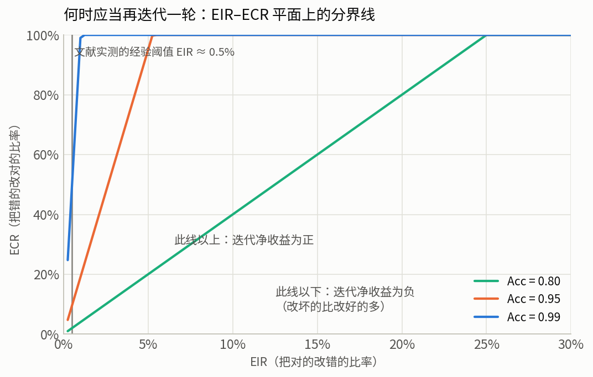

**图 13**：EIR–ECR 平面上的分界线。基线准确率越高，判据要求的 ECR/EIR 比值越大——**这正是「越接近正确，越不该再改」的定量表述**。当 $\mathrm{Acc}=0.95$ 时，判据要求 $\mathrm{ECR}/\mathrm{EIR} > 19$；当 $\mathrm{Acc}=0.98$ 时要求 $> 49$。这解释了一个反直觉的经验现象：在高质量代码上多跑几轮 AI 自审，期望收益往往是负的。

该文的实证部分覆盖 7 个模型 3 个数据集，结论对本报告至关重要，因为它**否定了「用前沿模型就没问题」这一假设**：

> "a sharp near-zero EIR boundary ($\lesssim$ 0.5%) cleanly separates beneficial from harmful self-correction: only o3-mini ($+3.4$ pp), Claude Opus 4.6 ($+0.6$ pp), and o4-mini ($\pm 0$ pp) stay non-degrading, while **GPT-5 and four others lose accuracy**."

并且给出了唯一被因果验证有效的提示层干预：

> "A **verify-first prompt intervention** then provides causal evidence: it drives GPT-4o-mini's EIR from 2% to 0% and converts a $-6.2$ pp degradation into $+0.2$ pp (paired McNemar, $p<10^{-4}$), with negligible change on already-sub-threshold models."

三条可操作推论，直接进入 §8 的设计：其一，**EIR 是需要在自己的代码库上测量的量，不是从模型卡上读的**；其二，前沿模型之间在这一维度上严重分化，模型选择不能只看基线能力；其三，**verify-first 必须写进 reviewer 的提示**——这是文献中唯一被因果证据支持的 EIR 压制手段。

---

## 3. 方法

### 3.1 数据集

全部一手数据于基准日 **2026-08-04** 经 GitHub GraphQL API 采集，共 **102 次 API 调用**，原始响应逐字落盘于 `raw/`，未做任何人工筛选或编辑。

| 编号 | 内容 | 规模 | 采集脚本 | 原始文件 |
|---|---|---|---|---|
| **D1** | 5 个成熟仓库最近 100 个**已合并** PR | 500 | `scripts/collect.py` | `raw/d1_merged_prs.json` |
| **D2** | 同上 5 仓库最近 100 个**关闭未合并** PR | 500 | `scripts/collect.py` + `collect_d2_nodejs_fallback.py` | `raw/d2_closed_prs.json` |
| **D3** | 4 个 coding agent 的已合并 / 关闭未合并 PR | 1,600 + 400 | `scripts/collect.py` | `raw/d3_agent_prs.json` |
| **D4** | 4 仓库 2026-02-01 起标题含 `Revert` 的已合并 PR 占比 | 13,205 分母 | `scripts/collect.py` | `raw/d4_reverts.json` |
| **D5** | 两个案例 PR 的完整事件流（review / thread / commit / 标签事件） | 2 | `scripts/collect.py` | `raw/d5_cases.json` |
| **D7** | 50 个成熟仓库 agent PR 上的全部 review 正文 | 259 条 | `scripts/collect.py` | `raw/d7_bot_review_text.json` |
| **D8** | D1 全部 500 个 PR 的作者身份（用于旁路批准归因） | 500 | `scripts/collect_d8_authors.py` | `raw/d8_d1_authors.json` |
| **LIT** | 22 篇论文全文（arXiv 取 e-print LaTeX 源码包，其余取 PDF） | 22 | `scripts/fetch_literature.py` | `lit/manifest.csv`（含 SHA-256） |

D1/D2 的 5 个仓库为 `kubernetes/kubernetes`、`rust-lang/rust`、`nodejs/node`、`pytorch/pytorch`、`python/cpython`。D3 的 4 个 agent 为 `copilot-swe-agent`、`devin-ai-integration`、`claude`、`google-labs-jules`；选择依据是**它们在 GitHub 上以 App 身份提交 PR，因而可用 `author:app/<slug>` 精确检索**。Cursor 与 Codex 在多数集成模式下以用户身份而非 App 身份提交，结构上不可按作者检索——这本身构成一个抽样局限，记入 §10。

### 3.2 复现

全部产物可从落盘的原始数据离线重算，不需要网络：

```bash
python3 scripts/analyze.py         # raw/ → `derived/stats.json`（93 个键）+ derived/tables/*.csv（11 张）
python3 scripts/plot.py            # derived/ → figures/*.png（16 张）
python3 scripts/gen_references.py  # lit/references.json → 附录 D 的文献表 + references.bib
python3 scripts/verify.py          # 正文的每个数字与每条引用 vs 落盘数据（195 条断言）
```

重新采集（会产生新的基准日，数值将与本文不同）：

```bash
python3 scripts/collect.py                    # D1–D5, D7
python3 scripts/collect_d2_nodejs_fallback.py # D2 的 nodejs/node 降级取数路径
python3 scripts/collect_d8_authors.py         # D8
python3 scripts/fetch_literature.py           # 22 篇全文（不随仓库分发）
python3 scripts/fetch_citation_metadata.py    # 自 arXiv / DBLP 取回著录信息
```

### 3.3 采集缺口的显式记录

采集期间 GitHub GraphQL 端点对重查询持续返回 HTTP 502。采集器的处理方式是**记录缺口而非缩小分母**：每次失败经 8 次指数退避重试后，将标签、时刻与最后错误写入 `raw/manifest.json` 的 `gaps` 字段，并继续下一批。本次共记录 **4 处缺口**，全部位于 D3 的分页：

| 缺口标签 | 影响 |
|---|---|
| `d3m:copilot-swe-agent:p3` | copilot 已合并样本止于 200 个而非 300 个 |
| `d3c:copilot-swe-agent:p1` | copilot 关闭未合并样本缺失 |
| `d3m:devin-ai-integration:p3` | devin 已合并样本止于 200 个 |
| `d3c:devin-ai-integration:p1` | devin 关闭未合并样本缺失 |

**后果必须明说**：D3 的 1,600 个已合并 PR 中，`claude` 与 `google-labs-jules` 各贡献 600 个，`copilot-swe-agent` 与 `devin-ai-integration` 各 200 个，构成不均衡。因此**任何 D3 的合并统计量都不能读作「agent 群体的平均行为」**，只能读作这四个 agent 在给定配比下的合成量；跨 agent 的比较一律使用 `t03` 的分层表（图 5）而非合并值。

### 3.4 测量效度：两处会颠覆结论的缺陷及其修正

本报告在分析阶段发现两个构念效度缺陷。它们值得单列，因为二者都足以让一个看似干净的结论完全反向。

**缺陷一：`reviews.totalCount == 0` ≠「无人过目」。** GitHub 的 review 计数只统计 review 对象。若项目通过机器人指令完成批准，批准事实不会计入。D1 中共有 **143 个已合并 PR** 的 review 计数为 0；借助 D8 的作者身份与落盘标签，可以逐条归因：

| 旁路通道 | 识别痕迹 | 命中 |
|---|---|---|
| Prow 的 `/lgtm` 指令 | `lgtm` 标签 | kubernetes 的 57 个零 review PR **全部命中**（57/57） |
| bors 合并队列（入队需 reviewer 显式 `r+`） | `S-waiting-on-bors` / `merged-by-bors` / `rollup` 标签 | rust 的 30 个零 review PR 全部命中 |
| 自动 backport | 作者为 `miss-islington` | cpython 54 个零 review PR 中 33 个 |

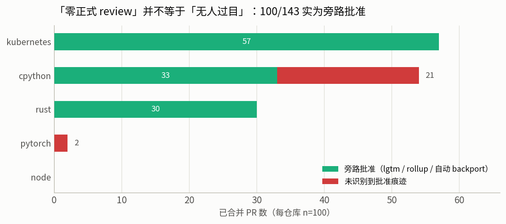

**图 14**：143 个「零正式 review」的已合并 PR 中，**120 个（83.92%）可归因于旁路批准**，剩余 23 个（占 D1 全样本 4.6%）未识别到批准痕迹——其中 21 个来自 cpython 的核心开发者自合并，2 个来自 pytorch。需要强调该判据的方向性：它能**证实**旁路批准的存在，不能**证伪**，因此 4.6% 是门禁缺失率的**上界**而非点估计。

与之互补的是一个**通道无关**的严格口径：`reviews.totalCount == 0` **且** `comments.totalCount == 0`，即该 PR 上既无 review 对象也无任何 issue 评论。它对旁路通道免疫，但会把机器人评论（CI 通知、CLA 检查）误算作「有人关注」，因此是**下界**。人类侧两个口径给出 **4.2%（下界）与 4.6%（上界）**，区间极窄，可以认为人类侧的门禁缺失率已被确定在 4–5%。

**缺陷二：agent 成熟层的 78 个 PR 不是独立观测。** 详见 §7.2。

### 3.5 文献核对协议

本报告对文献采取与数据同等的可审计标准，具体规则写在 `lit/quotes.md` 的开头：

1. 能取到全文的一律读全文；arXiv 条目下载 **e-print LaTeX 源码包**而非渲染后的 PDF，以便对宏展开前的原始措辞做精确检索。
2. 正文引用的**每一个数值**，其在原文中的确切措辞必须先登记进 `lit/quotes.md`。
3. 凡在全文中**未能定位**的数值，一律从正文移除，并记入 `lit/quotes.md` §9「已撤销的引用」，注明检索方式与命中数。
4. 全文本身不随本仓库分发（第三方版权），只分发 `manifest.csv`（URL + 字节数 + SHA-256）与引文摘录。

本次核对**撤销了 6 条引用**，包括一组曾被本项目早期草稿广泛使用的拒绝原因百分比（在所引论文中检索命中数为 0）、一个 agent 接受率排名（其中一个数值实为某类任务的分项值而非总体值）、以及若干无法定位的逐模型点值。撤销清单全文见 [`lit/quotes.md` §9](lit/quotes.md)。这一节的存在本身是本报告证据可靠性的主要凭据：**它显示核对是真的做了，且做出了会削弱既有叙述的结果。**

---

## 4. 文献时效性审计

### 4.1 判据

关于 AI code review 的实证文献在 2026 年集中出现，但其数据采集普遍早于发表 6–12 个月，而模型代际在同期跨越了 2–3 代。直接把这些结论当作当下约束是不严谨的。本报告使用一条可操作的判据来区分「会过期」与「不会过期」：

> **极限判据**：设想模型能力趋于无限强。若某条结论在该极限下**仍然成立**，它是**结构型**结论，不随模型进步而失效；若在该极限下**不再成立**，它是**能力型**结论，其有效期以采集窗口为限。

判据的有效性来自它对因果结构的区分。「LLM 不能内生自我纠错」在极限下显然不成立（一个足够强的模型可以）。而「用不完美 evaluator 作为优化目标会产生 reward hacking 压力」在极限下**仍然成立**——因为 evaluator 的不完美是相对于*人类偏好*定义的，模型变强并不会自动使 evaluator 与人类偏好对齐。同理，「无界反馈路径不保证终止」在极限下也成立：一个无限聪明的 agent，若协议允许它一直提意见，它依然可以一直提。

**这条判据推出本报告最重要的单句结论：有穷性是协议属性，不是能力属性。因此「等模型更强」不能解决这个问题。**

### 4.2 逐条审计

| 结论 | 依赖类型 | 当下参考价值 | 判定理由 |
|---|---|---|---|
| LLM 不能内生自我纠错（GPT-3.5 / GPT-4 时代）[[9]](#ref-2310.01798) | 能力型 | ⚠️ **结论过期，机制保留** | 已被 EIR/ECR 框架取代（§2.5）；机制（净收益由两个转移率之比决定）仍然正确，判据须更换 |
| 迭代精修产生 in-context reward hacking[[15]](#ref-2407.04549) | 结构型 | ✅ 有效 | 只要「用不完美 evaluator 做优化目标」这一结构不变，压力就存在 |
| 自偏好在多轮中被放大[[20]](#ref-2402.11436) | 混合 | 🟡 部分有效 | 结构性成分保留；放大幅度随模型改善，需重测 |
| 增益集中在前 1–2 轮[[14]](#ref-2303.17651) | 结构型 | ✅ 有效 | 错误密度递减的算术必然，与能力无关 |
| 无界 agent 循环的分类与「有效界」判据[[8]](#ref-2607.01641) | 结构型 | ✅ 完全有效 | 讨论的是界的作用域，与模型无关 |
| CRA-only PR 合并率 45.20%、信噪比 <60%[[4]](#ref-2604.03196) | 产品能力型 | ❌ 应视为 2025 年中快照 | 数据截止 2025-08-01 |
| CodeRabbit 评论 56.3% 被拒[[12]](#ref-2607.03316) | 产品能力型 | ❌ 同上 | 同上 |
| 人类审查 AI 代码的习惯化（批准率 ↑、行内评论 ↓22%）[[22]](#ref-2606.22721) | 人类行为 | 🟡 趋势可信，幅度待重测 | 注意力经济学不会一年内变，但自变量（AI PR 质量）变了 |
| 人类侧全部工程惯例（Google / Node.js / k8s / Rust / Apache / GitLab）[[31]](#ref-google-standard)[[33]](#ref-nodejs-collaborator)[[32]](#ref-k8s-pr)[[34]](#ref-rfcbot)[[23]](#ref-apache-voting)[[30]](#ref-gitlab-review) | 组织设计型 | ✅ 完全有效 | 社会协议；跨组织独立收敛[[17]](#ref-rigby2013)这一事实本身即为其稳定性证据 |

### 4.3 承重引文

时效性论证的全部重量压在一句话上。2026 年这批 AI code review 实证研究几乎全部构建于同一个数据集[[11]](#ref-2602.09185)之上，而该数据集的采集窗口在其论文中有逐字表述（[`lit/quotes.md`](lit/quotes.md) §1.1）：

> "\aidev comprises 932,791 \agentprs authored by five agents: \codex, \devin, \copilot, \cursor, and \claude, across 116,211 repositories involving 72,189 developers (**dataset cutoff: August 1, 2025**)."

即：**这些论文测量的是 2025 年 8 月 1 日之前的 agent 行为**，距本报告基准日 2026-08-04 约 **12 个月**。

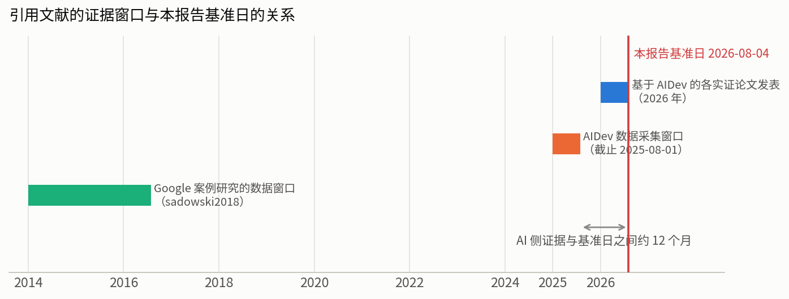

**图 12**：各文献的证据窗口与本报告基准日的关系。这不意味着这些论文没用，而是**用途要改**：它们不再是「当下能力上限」的证据，而是「**放任不管会发生什么**」的历史对照组。§7 中我们对同类问题在当下重新取数，并把两者并置。

一个必须一并引用的限定来自同批文献中关于 agent 接受率的研究[[16]](#ref-2602.08915)：**任务类型比 agent 身份更能解释接受率差异**（documentation 82.1% vs new features 66.1%，16 个百分点的差距超过多数任务上的 agent 间方差）。本报告因此**不引用任何 agent 之间的总体排名**（早期草稿中的一组排名已撤销，见 `lit/quotes.md` §9.2）。

---

## 5. 人类侧实证

### 5.1 合并侧：正式阻塞态是稀有事件

D1 的 500 个已合并 PR 中：

| 指标 | 合并值 | 逐仓库范围 |
|---|---|---|
| 零 `CHANGES_REQUESTED` | **97.8%** | 93.0%（rust）– 100.0%（cpython） |
| ≥1 次 `CHANGES_REQUESTED` | 2.2% | — |
| 单个 PR 上出现过的最多阻塞次数 | **2** | — |
| review 提交数（中位） | **1** | 0（k8s、cpython）– 3（node） |
| 改动行数（中位） | 38 | 26（cpython）– 105（rust） |
| 创建到合并耗时（中位） | 67.8 h | 11.6 h（pytorch）– 235.1 h（k8s） |
| `APPROVED` 次数（中位） | 1 | 0 – 3 |
| 零 `APPROVED` 合并 | 39.8% | — |

逐仓库明细（完整表见 [`derived/tables/t01_merged_pr_review_structure.csv`](derived/tables/t01_merged_pr_review_structure.csv)）：

| 仓库 | n | 零 CR | review 提交 中位 / p90 / 最大 | 改动中位 | 合并耗时中位（h） | 批准中位 | 零正式 review |
|---|---:|---:|---:|---:|---:|---:|---:|
| rust-lang/rust | 100 | 93.0% | 1 / 12 / 49 | 105 | 64.8 | 0 | 30.0% |
| nodejs/node | 100 | 98.0% | 3 / 7 / 33 | 39 | 123.7 | 3 | 0.0% |
| pytorch/pytorch | 100 | 99.0% | 1 / 2 / 9 | 31 | 11.6 | 1 | 2.0% |
| kubernetes/kubernetes | 100 | 99.0% | 0 / 8 / 293 | 54 | 235.1 | 0 | 57.0% |
| python/cpython | 100 | 100.0% | 0 / 2 / 32 | 26 | 27.6 | 0 | 54.0% |

**k8s 与 cpython 那两个畸高的「零正式 review」值不是门禁缺失**，其成因见 §3.4；这一列在做跨仓库比较前必须先做通道归因。

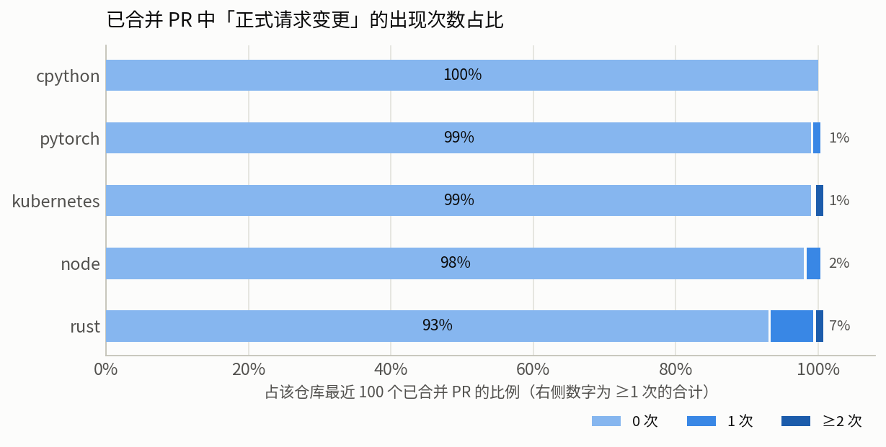

**图 1**：正式阻塞态的出现次数分布。**这张图的正确读法不是「几乎没有返工」**，而是「**返工几乎不通过正式阻塞态进行**」——同一批 PR 的 review 提交数 p90 达 2–12，最大值在 k8s 上高达 293。

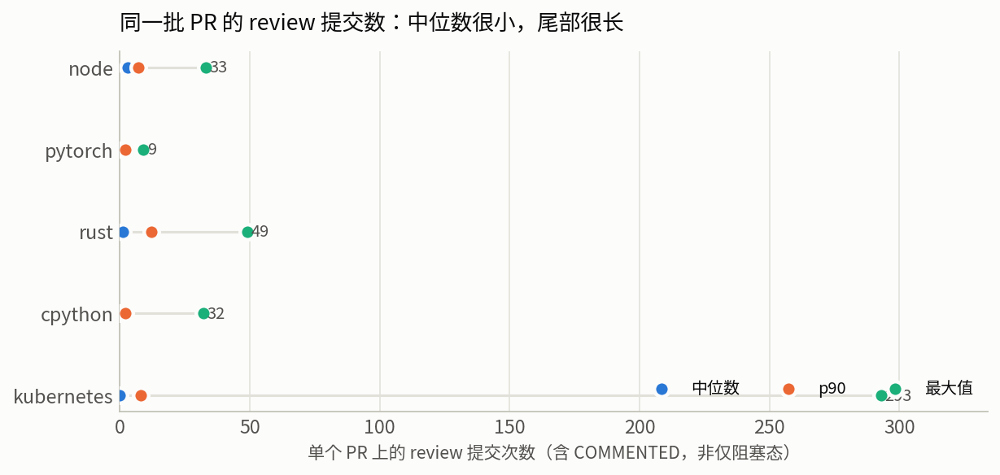

**图 2**：同一批 PR 的 review 提交数的中位 / p90 / 最大值。中位数极小而尾部极长，这个形状本身就是机制①（语义降级）的指纹：迭代通过大量**非阻塞评论 + 作者自行裁量**完成，正式的 `Request changes` 被保留给原则性分歧。这与 Node.js 协作者指南把「表达异议」与「构成否决」明确区分开来的条款是同一件事的两面——**光是发表反对意见不算否决**，必须显式按下 Request Changes 才算。

**一个必须与之并读的数字**：39.8% 的已合并 PR 上 `APPROVED` 次数为 0，而 §3.4 已证明其中大部分属于旁路批准。这提醒任何基于 GitHub review 对象的度量都必须先做通道归因，否则会把「批准走了别的通道」误读成「没有批准」。

### 5.2 未合并侧：现实中的终止方式是超时与放弃

这是被讨论得最少、却最能回答 RQ1 的一半。D2 的 500 个关闭未合并 PR：

| 指标 | 合并值 |
|---|---|
| 开放天数（中位） | **7.0** |
| 开放天数（p90） | **316.6** |
| 开放天数（最大） | 2,847.6 |
| 从未被 review 过 | **51.2%** |
| 曾出现 ≥1 次 `CHANGES_REQUESTED` | 7.6% |
| 带 stale / lifecycle 类标签 | 22.4%（kubernetes 最高，60.0%） |

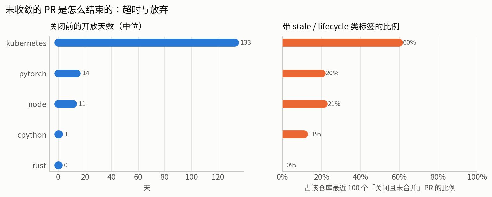

**图 3**：左为关闭前开放天数中位，右为 stale 类标签占比。逐仓库差异极大——rust 的中位仅 0.2 天（68% 在一天内关闭），kubernetes 则是 132.7 天且 60% 带生命周期标签。这两种形态对应两种不同的终止装置：**快速拒绝**与**超时清理**。

结论是朴素但重要的：**现实中「不收敛」的终止方式主要是超时与放弃，而不是收敛。**只有 7.6% 的失败 PR 曾进入过正式阻塞态，超过一半根本没有被 review 过。Kubernetes 把超时写成了明文政策（「超过 90 天的 PR 将被关闭」），其给出的理由是一个漂亮的机制设计论证：PR 陈旧后 rebase 成本递增，而关掉的 PR 重开很容易、损失的工作很少——**这是刻意把「重新开始」设计得比「无限继续」更便宜**。

### 5.3 移出本 PR 的价格：revert 率

「允许带瑕疵合并、事后修复或回滚」（§6 的机制④）是缩短循环最有力的手段，但它显然有代价。我们用一个粗略但可复算的代理量测这个代价：2026-02-01 以来已合并 PR 中标题含 `Revert` 的比例。

| 仓库 | 已合并 | 标题含 Revert | 比例 |
|---|---:|---:|---:|
| rust-lang/rust | 4,303 | 46 | **1.07%** |
| kubernetes/kubernetes | 1,971 | 18 | **0.91%** |
| python/cpython | 5,573 | 31 | **0.56%** |
| nodejs/node | 1,358 | 6 | **0.44%** |
| **合计** | **13,205** | **101** | **0.76%** |

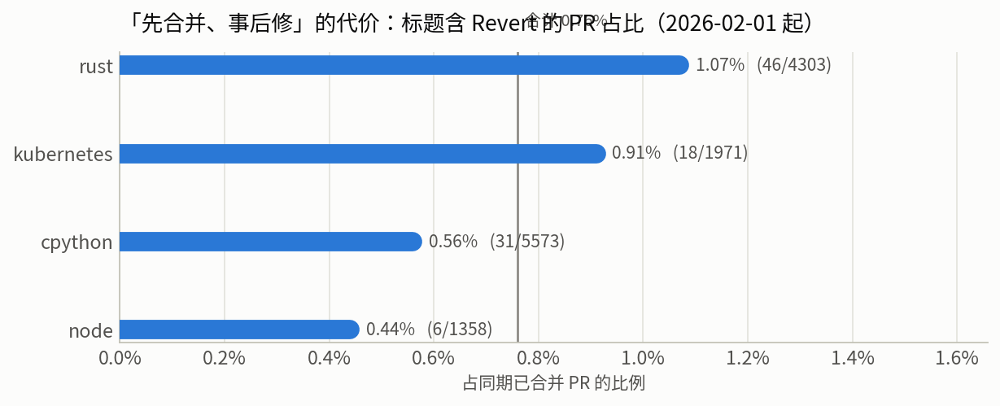

**图 11**：四个仓库的 revert 比例。标题匹配会**低估**真实回滚率（有些回滚不以 Revert 命名，也有些以 forward-fix 而非 revert 完成），因此 0.76% 应读作下界。

即便如此，量级是清楚的：**把「带瑕疵合并 + 事后修」作为默认策略，代价约为 0.5%–1% 的回滚率。** 这个数字有直接的工程用途——它是一条**双向**基准线：显著高于 1% 说明门开得过松，等于 0 则说明门卡得过紧（在过度阻塞上支付的成本没有被计量）。

### 5.4 案例 A：一个 112 天但完全收敛的 PR

为了区分「长」与「不收敛」，我们逐事件还原了 `rust-lang/rust#148190`（*replace box_new with lower-level intrinsics*）。它是 D1 样本中 review 提交数最多的 PR 之一。

| 属性 | 值 |
|---|---|
| 时长 / 改动 / 文件 | 112.0 天 / 2,724 行 / 100 个文件 |
| review 提交 | **49 次**：`COMMENTED` 48 + **`APPROVED` 1** + `CHANGES_REQUESTED` **0** |
| 参与者 | 11 人，其中作者本人自评 33 次 |
| 标签事件 | 40 个，其中 `S-*` 状态事件 32 个，涉及 6 个不同状态 |

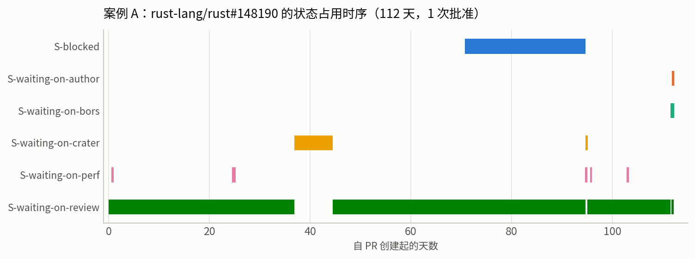

**图 7**：`S-*` 状态的占用时序。可以直接读出四件事。

**第一，绝大多数等待在等机器，而不是在等人的意见。** `S-waiting-on-crater`（全生态编译验证）占 7.7 天，`S-waiting-on-perf` 触发 6 次，另有 `S-waiting-on-bors`（合并队列）。这些谓词**可判定且有确定完成时间**，它们不会发散。

**第二，人类的批准只需要一次，且在最后。** 全程 48 次 `COMMENTED` 是讨论，不具阻塞力；只有 1 次 `APPROVED`。

**第三，`S-blocked` 是显式的「暂停并让出」**，占据第 70.7 至 94.7 天，而不是在本 PR 里继续争论。

**第四（一处对既有说法的修正）**：这套状态机**不是**单持有者的。本报告早期草稿曾断言「任何时刻状态唯一、球的持有者唯一」。逐区间计算后该断言被证伪：112 天中有 **24.8 天（22.1%）同时挂着 ≥2 个 `S-*` 标签**，主要来自 `S-blocked` 与 `S-waiting-on-review` 长达 24 天的重叠。正确的表述是：**`S-*` 家族提供的是机器可读的等待原因标注，而非互斥的状态变量**；它降低了「双方都在等对方」的模糊度，但并未在协议层排除并发占用。这一区别在移植到 agent 系统时很重要——若要靠状态机消除死锁，互斥性必须被显式强制，不能假定它自然成立。

**结论：一个 112 天的 PR 不是「无限循环」，而是一条每步都有明确等待原因和确定终止条件的长流水线。长 ≠ 不收敛。** 这个区分对设计 AI 系统极其重要：优化目标应该是「消除无界重触发」，而不是「压缩总时长」。

### 5.5 与既有文献基线的对照

本报告的人类侧测量并非在真空中进行。把它与已发表的基线并置，既是外部效度检验，也能暴露哪些是新增证据、哪些只是复现。下表中的文献数值全部经全文核对并登记于 [`lit/quotes.md`](lit/quotes.md) §3。

| 文献结论（及其证据窗口） | 文献值 | 本报告实测（2026-08-04） | 判读 |
|---|---|---|---|
| 「超过 80% 的变更至多经历一轮作者—回应迭代」，Google，9,000,000 个变更，2014-01 至 2016-07[[18]](#ref-sadowski2018) | >80% | 97.8% 的已合并 PR 零正式阻塞态；review 提交中位 1 | **方向一致但口径不同**：文献计的是迭代轮次，本报告计的是正式阻塞态。二者共同支持「返工不通过阻塞态进行」 |
| 「通常只需一名 reviewer 批准」[[18]](#ref-sadowski2018) | 1 | `APPROVED` 次数中位 1；案例 A 全程仅 1 次 | **一致** |
| 评审参数在完全不同的组织间独立收敛到相近值[[17]](#ref-rigby2013) | — | 5 个仓库零阻塞态 93.0%–100.0%，跨组织高度一致；但 review 提交中位 0–3、合并耗时中位 11.6–235.1 h 差异极大 | **部分一致**：阻塞态的稀有性收敛，节奏与讨论量不收敛 |
| 评论数是评审延迟的最强单一预测因子；churn、规模与讨论长度合计解释已解释方差的 67%，103,284 个 PR / 40 个项目[[21]](#ref-yu2015) | R²=46.1% | 本报告不做回归，未复现 | **不适用**，但其含义支持 §6 的「小 diff」建议 |
| 评审的核心难点是**理解**变更而非判断其对错[[2]](#ref-bacchelli2013) | — | 案例 A 中 48/49 次 review 为 `COMMENTED`（讨论），仅 1 次为批准 | **一致**，且提示 AI 最该做的是帮人更快理解 diff，而非替人下判断 |
| 整合者侧的工作实践与拒绝沟通困难，749 位整合者问卷[[6]](#ref-gousios2015)；贡献者侧的对应研究[[7]](#ref-gousios2016) | — | D2 中 51.2% 的失败 PR 从未被 review——沟通根本没有发生 | **一致且更极端**：文献描述的是「解释拒绝很难」，本报告观察到的是「多数根本不解释」 |
| 评审参与度本身是被研究的对象[[19]](#ref-thongtanunam2016) | — | D1 中人类 reviewer 数中位 0–3，逐仓库差异极大 | 提供当下截面，未与其数值比对 |

**必须指出的时效性不对称。** Google 那组数字的证据窗口是 2014-01 至 2016-07，距本报告基准日约十年。按 §4.1 的极限判据，它属于**组织设计型**结论，其稳定性不由数据新鲜度支持，而由跨组织独立收敛这一事实支持。本报告的实测在方向上复现了它，这本身就是对该判定的一次弱检验。

---

## 6. 机制归纳：四类终止装置

§5 的数据说明成熟项目确实在有限步内终止，且终止不来自「意见清空」。本节从公开成文的工程条款中归纳出四类终止装置，并把每一类对回 §2.3 的发散源。**本节所有引文均于 2026-08-04 回原始文档逐句复核**；未能复核的条款已从早期草稿中移除（见本节末尾）。

### 6.1 机制①：语义降级——绝大多数意见不许阻塞

**对治发散源 II（谓词不可判定）**。做法是把「意见」按裁决依据分类，只有可被外部权威裁决的那一类保留阻塞力，其余在协议上降级。

Google 的评审标准[[31]](#ref-google-standard)把这条称为所有评审准则中**最高级**的一条：

> "reviewers should favor approving a CL once it is in a state where it definitely improves the overall code health of the system being worked on, even if the CL isn't perfect."

> "That is *the* senior principle among all of the code review guidelines."

GitLab 的表述[[30]](#ref-gitlab-review)最具可操作性，因为它直接规定了状态推进条件而非态度：

> "When only non-blocking suggestions remain, move the MR to the next stage rather than waiting."

并且把风格问题整类移出评审：

> "Enforce code style through automation rather than review comments."

Node.js[[33]](#ref-nodejs-collaborator) 则从反面把「表达异议」与「构成否决」在协议层分开：

> "Collaborators can object to a pull request by using the \"Request Changes\" GitHub feature."

> "Dissent comments alone don't constitute an objection, nor do dissenting comments made in any associated issue."

> "A blocking objection to a change must be made in the pull request that specifically proposes that change."

**这三处条款的共同形状值得注意**：它们都不是在劝人克制，而是在**让「无限期坚持」在规则上不可能**。§5.1 中 97.8% 零阻塞态而 review 提交数长尾的分布形态，正是这套规则在数据上的指纹。

### 6.2 机制②：时钟——给每个状态挂死线

**对治发散源 I 与 III**：即便意见集合非单调、即便存在僵持，墙钟也会强制推进。

Node.js 的条款[[33]](#ref-nodejs-collaborator)是本报告见过最完备的一组有穷性协议：

> "Before landing pull requests, allow 48 hours for input from other collaborators."

> "At least two collaborators must approve a pull request before the pull request lands."

> "One collaborator approval is enough if the pull request has been open for more than seven days."

第三条是**批准门槛随时间衰减**——一个优雅的防饿死设计。更关键的是它的反死锁条款，它给否决权本身加了一个时钟：

> "If the objector is unresponsive for seven days after a collaborator asks for clarification, a collaborator may dismiss the objection."

Kubernetes 的时钟[[32]](#ref-k8s-pr)作用在 PR 整体寿命上，且把理由写得很清楚：

> "Pull requests older than 90 days will be closed."

> "Closed pull requests are easy to recreate, and little work is lost."

**后一句是整条政策的机制设计核心：它把「重新开始」的成本压到低于「无限继续」。** §5.2 中 kubernetes 60.0% 的关闭未合并 PR 带有生命周期标签、开放天数中位 132.7 天，正是这条政策的执行痕迹。

Rust 的 FCP（Final Comment Period）是时钟与仲裁的混合形态。经复核，rfcbot[[34]](#ref-rfcbot) 的机制要点是：

> "To register blocking concerns on the FCP proposal, use `@rfcbot concern NAME_OF_CONCERN`."

> "only the original author can mark their concern as resolved"

且 bot 会在 FCP 起始一周后发布跟进评论。**这个设计有一个理论上的发散风险必须指出**：每个新 concern 都会推迟 FCP 完成，若有人持续提出新 concern，FCP 可以无限延长。Rust 用「只有团队成员可提阻塞性 concern」这一资格约束来限制它——**即用机制③补机制②的漏洞**。这个组合在设计 AI 系统时值得照抄：单纯的时钟会被无限的新意见抵消，必须同时限制**谁有资格重启时钟**。

### 6.3 机制③：仲裁——分歧必须有单调收敛的裁决链

**对治发散源 III（对称否决）**。核心是让否决权非对称，并给否决本身设置举证成本。

Apache 的条款[[23]](#ref-apache-voting)是这一思路的极端形式，同时包含了「不可推翻」与「必须举证」两面：

> "it cannot be overruled nor overridden by anyone. Vetoes stand until and unless the individual withdraws their veto."

> "A veto without a justification is invalid and has no weight."

**后一句是本报告认为最值得移植到 AI 系统的单条规则**：否决权不是免费的，行使它必须付出举证成本，且举证不合格时否决**自动无效**——不需要任何人去推翻它。§8.2 的不变量 2 就是这条规则的机器化。

Kubernetes[[32]](#ref-k8s-pr) 把「代码质量」与「合并授权」拆成两个正交信号，构成权限型仲裁的教科书实现：

> `/lgtm`：由 OWNERS 中的 reviewer 给出，"is a signal that the code has passed review from one or more trusted reviewers"
> `/approve`：由 OWNERS 中的 approver 给出，signals "that the code has passed final review and is ready to be automatically merged"

两个标签齐备且 CI 通过后，PR 进入 Tide 合并池，"If tests pass, Tide automatically merges the pull request"——**终局由机器执行，人不再介入**。而 `/hold` 与 `WIP` 前缀提供了显式的暂停通道："While either label is present, your pull request will not be considered for merging."

GitLab 的仲裁[[30]](#ref-gitlab-review)则通过角色定义实现，其特点是**把批准与长期责任绑定**：

> "Reviewers are responsible for reviewing the specifics of the chosen solution."

> "Maintainers are responsible for the overall health, quality, and consistency of the GitLab codebase."

> "when there is a production incident, the maintainer may get paged to help resolve issues"

最后是升级路径的强制性。Google 的条款[[31]](#ref-google-standard)是命令式的：

> "Don't let a CL sit around because the author and the reviewer can't come to an agreement."

### 6.4 机制④：把下一轮移出本 PR

**这是把循环变成尾递归的技巧**：剩余分歧不在本 PR 内解决，而是转化为别的工件。它同时对治三个发散源，因为它直接减小 $|B_n|$ 的定义域。

Node.js[[33]](#ref-nodejs-collaborator) 把「合并后发现问题」明确设为正常路径而非异常：

> "Mistakes do happen. If a pull request is merged with an unresolved objection, submit a fix."

> "Simple issues may be fixed with a follow-up PR that addresses the concern. More difficult issues may require a full revert."

GitLab 则把「对既有模式的异议」整类移出：遵循现有模式，另开 MR 去提议改变这个模式。Google 的「不追求完美，只要更好」是同一哲学的另一面。

**§5.3 已经量化了这个机制的价格：0.76% 的回滚率（下界）。** 这是本报告认为最值得记住的一个交换比——**用约 1% 的回滚，换掉绝大多数的第 N 轮评审**。

### 6.5 四类装置与发散源的对应

| 装置 | 对治的发散源 | 形式化含义 | 代表条款 |
|---|---|---|---|
| ① 语义降级 | II（谓词不可判定） | 收缩 $B_n$ 的定义域至可裁决子集 | Google「只要更好」；GitLab「只剩非阻塞建议就推进」；Node.js「异议 ≠ 否决」 |
| ② 时钟 | I、III | 施加外生的良基度量（剩余时间） | Node.js 48h / 7 天衰减 / 7 天驳回；k8s 90 天关闭 |
| ③ 仲裁 | III（对称否决） | 破坏否决权的对称性，给否决加举证成本 | Apache「无论证的 veto 无效」；k8s lgtm/approve 分离；GitLab reviewer/maintainer 分层 |
| ④ 移出本 PR | I、II、III | 缩小 $B_n$ 的定义域本身 | Node.js follow-up / revert；GitLab「另开 MR 改模式」 |

### 6.6 本节撤销的条款

按 §3.5 的同一标准，以下曾出现在本项目早期草稿中的条款，在 2026-08-04 的复核中**未能在所引文档中找到**，已移除：

- **「Node.js 无活动超过 6 个月 → `stalled` 标签 → 自动关闭」**：现行 collaborator guide 中不存在 `stalled` 标签，也不存在基于不活跃的自动关闭政策。文档中最接近的表述是酌情处理（"Collaborators can close any issue or pull request that is not relevant to the future of the Node.js project."）。本报告因此**不把 Node.js 列为「超时自动关闭」的实例**，该机制的实例仅保留 Kubernetes。
- **「Rust FCP 持续 10 天，且在所有 concern 清空后重新起算」**：rfcbot 的 README 只写了 FCP 起始一周后发布跟进评论，未见「10 天」与「重新起算」的表述。本报告改为只引用已复核的部分（concern 阻塞、只有提出者本人可解除）。

---

## 7. agent 侧实证

### 7.1 分层结果

D3 覆盖 4 个 agent 的 **1,600 个已合并 PR**，分布在 **432 个仓库**。首先是一个结构性事实：这 1,600 个 PR 中只有 **78 个（4.88%）**落在 star ≥ 500 的仓库里，涉及 24 个仓库；`google-labs-jules` 的 600 个 PR **无一**落在成熟仓库。

| 分层 | n | 合并耗时中位 | <10 min 合并 | 零正式 review | 零 review 且零评论 | review 提交中位 | 改动中位 |
|---|---:|---:|---:|---:|---:|---:|---:|
| 全样本 | 1,600 | 45.3 min | 29.12% | 71.0% | 22.62% | 0 | 83 |
| star ≥ 500 | 78 | 683.3 min | 2.56% | 35.9% | 29.49% | 1 | 38 |
| star < 500 | 1,522 | 39.6 min | 30.49% | 72.8% | 22.27% | 0 | 85 |
| **人类对照（D1）** | **500** | **4,068 min** | — | **28.6%** | **4.2%** | **1** | **38** |

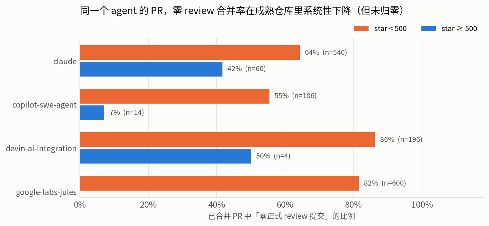

**图 5**：逐 agent 的分层对照。分层效应在三个有成熟仓库样本的 agent 上方向一致（claude 64%→42%，copilot 55%→7%，devin 86%→50%），但**成熟层的样本量分别只有 60 / 14 / 4**，因此这是指向性证据而非统计结论。

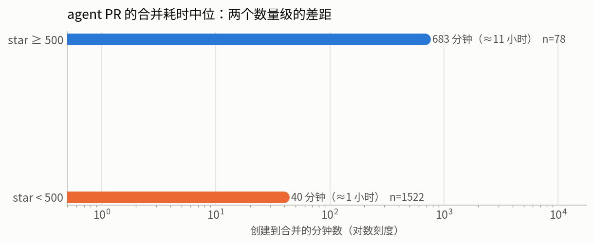

**图 6**：合并耗时。两层相差约一个数量级（39.6 分钟 vs 683.3 分钟），而人类对照是 67.8 小时。

与之互补的一条既有证据是对 agentic PR 修复被拒原因的定性研究[[1]](#ref-2606.13468)：其归纳出的四类拒绝原因中，「实现不正确」与「未通过 CI」两类都指向同一个对策方向——**把可自动判定的部分交给 verifier**，这与 §8.1 的分层一致。该研究同属 2025 年中窗口，故此处只取其定性归纳。

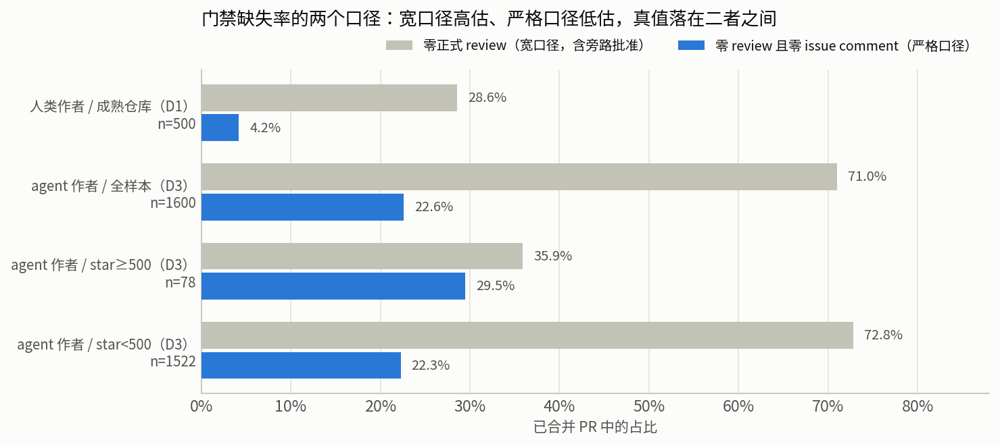

**图 4**：两个口径下的门禁缺失率。**这张图是本报告最核心的一张**，读法必须小心：灰条（宽口径）在人类侧被旁路批准严重污染（§3.4），蓝条（严格口径）在两侧都可能被机器人评论稀释。可靠的比较只有一种——**在同一口径内跨组比较**。

### 7.2 成熟层的聚簇：一个足以推翻跨层比较的问题

表面上，成熟层的严格口径（29.49%）比小仓库层（22.27%）更差，这与「成熟度决定门禁强度」的假设相悖。逐仓库分解后原因清楚了：

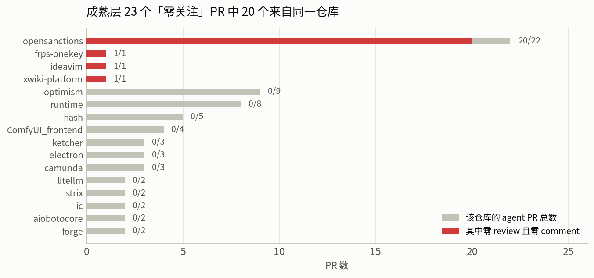

**图 15**：成熟层 78 个 PR 分布在 24 个仓库上，**23 个「零 review 且零评论」的 PR 中有 20 个（86.96%）来自同一个仓库** `opensanctions/opensanctions`（该仓库贡献了成熟层 28.21% 的 PR）。全部 24 个仓库中只有 **4 个**出现过任何一例。

这是典型的**伪重复**（pseudo-replication）：78 个 PR 不是 78 个独立观测，因为同一仓库内的 PR 共享同一套合并策略。有效样本量接近仓库数（24）而非 PR 数（78）。三个稳健性检查：

| 估计量 | 成熟层（n=78, 24 仓库） | 小仓库层（n=1522, 408 仓库） |
|---|---|---|
| 按 PR 计数 | 29.49% | 22.27% |
| **留一仓库刀切区间** | **5.36% – 33.33%** | **20.87% – 22.94%** |
| 刀切最小值对应仓库 | `opensanctions/opensanctions` | — |
| 仓库级宏平均（每仓库一票） | 16.29% | 25.16% |
| 最大单一仓库占比 | 28.21% | 3.68% |

**结论必须分两半写。** 成熟层：按 PR 计数的比率**不稳健**，刀切区间跨越 6 倍，因此**任何基于该层比率的跨组比较都不成立**；我们不能断言成熟仓库对 agent PR 的门禁弱于或强于人类 PR。小仓库层：刀切区间仅 20.87%–22.94%、最大仓库占比 3.68%、宏平均与 PR 计数同量级，**该层结果稳健**。

因此，本报告在 agent 侧唯一敢下的稳健结论是：

> **在低成熟度仓库中，agent 撰写的 PR 有约 22% 在既无任何 review 也无任何评论的情况下被合并，约为人类侧基线（4.2%–4.6%）的 5 倍。而在成熟仓库中，现有样本不足以支持任何方向的跨组比较。**

**这里必须记录一次自我修正。** 本项目在扩样之前，曾基于 n=16 的小样本断言「成熟仓库对 agent PR 零漏检、审查强度是人类 PR 的 3–10 倍」。扩样至 n=78 后该断言被推翻（成熟层 35.9% 零正式 review、review 提交中位为 1，与人类中位相同）；再做聚簇诊断后，连「扩样后的成熟层比率」本身也被判定为不可用。**同一个结论被自己的后续数据连续否定两次，这件事本身是本报告方法论的主要证据**——它说明这套流程能够检出并纠正自己的错误，而不只是在积累看起来一致的证据。

### 7.3 AI reviewer 的信噪比：当下实测

文献中的信噪比数字属于 §4.2 判定的「产品能力型、应视为 2025 年中快照」。我们在当下重测：抓取 50 个成熟仓库 agent PR 上的**全部 review 正文**，共 259 条 review 记录，其中机器人 review 93 条、正文非空 62 条。

| reviewer | 非空正文 | 机械失败模板 | 实质内容占比 |
|---|---:|---:|---:|
| `copilot-pull-request-reviewer` | 59 | 35 | **40.68%** |
| `github-actions` | 3 | 0 | 100.0% |
| **合计** | **62** | **35（56.45%）** | **43.55%** |

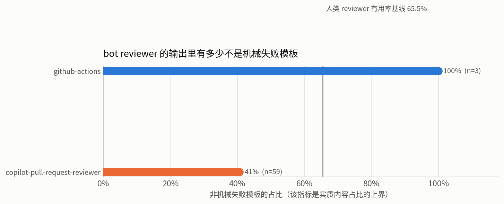

**图 10**：机器人 review 输出中非机械失败的比例。判据是显式自述失败的模板句（"unable to review"、"no eligible user to bill"、"could not review"、"quota"、"rate limit" 等），**不做任何语义判断**。因此 43.55% 是实质内容占比的**上界**——真正空洞但语法完整的评论无法用这个判据识别。

同一时期另有研究专门刻画 reviewer bot 在 agentic PR 上留下的痕迹[[5]](#ref-2604.24450)，其证据窗口同属 §4.3 所述的 2025 年中快照，故本报告只用其问题设定、不引用其数值。

**这个数字的正确解读方式不是「AI reviewer 很差」，而是「集成没做对」。** 机械失败模板的含义是 reviewer 根本没有运行（计费失败、配额耗尽），而不是运行后给出了低质量意见。**这是一个纯粹的运维缺陷，与模型能力无关**，而它在生产环境里持续了整整 50 个 PR 没有被任何人关掉——这恰好是 §2.4 所说的「反馈路径上没有有效界」的实例：失败是静默的，没有任何机制在计数。

同时必须给出人类基线以避免双重标准。人类 reviewer 评论的有用率经全文核对[[3]](#ref-bosu2015)为：

> "Interestingly, all projects have a similar comment usefulness density between 64% and 68%."

其逐项目合计为 190,050 个 review request / 1,496,340 条评论 / 979,440 条有用，即 **65.5%**。**因此评判 AI reviewer 的目标线是 64%–68%，不是 100%。** 人类 reviewer 大约每三条意见就有一条被判定为无用；差别在于人类之间存在社交淘汰压力，而 AI 没有——**所以对 AI 必须用协议强制，而不能指望自然淘汰**。

### 7.4 案例 B：AI 写、AI 评审全程空转、人类仲裁终止

`dotnet/runtime#131642`（*Remove calli target tagging from CoreCLR interop stubs*）是 D3 成熟层中 review 最多的 PR，作者为 `copilot-swe-agent`。

| 属性 | 值 |
|---|---|
| 时长 / 改动 / 文件 / commit | 3.3 天 / 259 行 / 21 个文件 / **22 个 commit** |
| review 提交 | **66 次**，其中 `APPROVED` 1、`CHANGES_REQUESTED` **0** |
| 按作者分解 | `jkotas` 24、`copilot-swe-agent` 21、`copilot-pull-request-reviewer` 20、`janvorli` 1 |
| review thread | 22 条，**全部 22 条由 `jkotas` 一人开启**；22 条全部 resolved，21 条 outdated |
| 回退类 commit | **4 个** |
| agent 对 review 的响应延迟 | 中位 **20.9 分钟**，p90 33.4 分钟（n=43） |

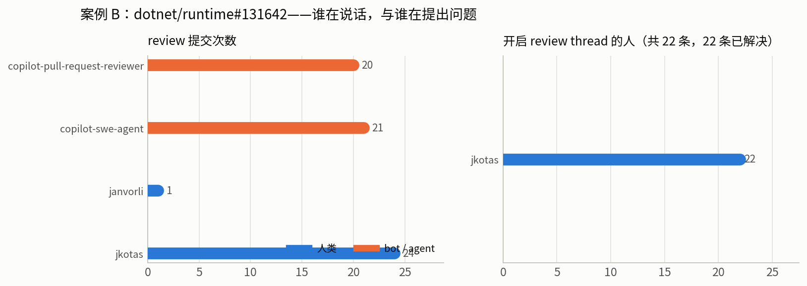

**图 8**：review 提交与 thread 开启的行为者分解。**注意两者的不对称**：review 提交数上 AI reviewer 占 20/66，但在真正承载技术内容的 thread 上，**22 条全部由一位人类架构师开启，AI reviewer 贡献 0 条**。

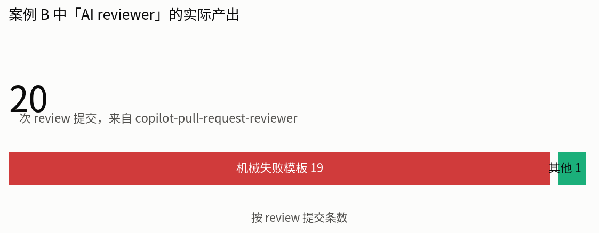

**图 9**：该 AI reviewer 的 20 次提交中，**19 次为机械失败模板**（"unable to review … no eligible user to bill"），实质内容 1 次。

**四条可直接移植的教训：**

**其一，一个配置错误的 AI reviewer 会在 every-push 模式下空转 20 轮而无人察觉。** 它对每次 push 触发、每次输出计费错误、失败完全静默。这就是「反馈路径未被有效界覆盖」的实例——只不过这里循环的代价不是 token，是**信噪比污染**与 20 条无意义的评审记录。**出问题的不是模型，是触发策略 + 失败静默。**

**其二，agent 的响应速度本身是风险。** 中位 20.9 分钟、p90 33.4 分钟的响应延迟，意味着一位人类评审者在一天内要面对 22 个 thread 和 22 个 commit 滚过去。这是吞吐量不对称：**一个 agent 可以在人类的一次思考周期内完成数轮修改**。GitLab 的对应条款正是缺失的那一条节流规则——"Re-request review once you are ready for another round."

**其三，4 个回退类 commit 是发散源 I 的真实指纹。** `Revert importercalls.cpp changes per review`、`Restore lower.cpp MethodDesc publication path`、`Revert SetNextCallFrameMethodDesc changes`、`Revert JITEE version GUID change`——agent 反复越界修改后被要求回退。**每一轮不是在收敛，而是在探索边界。** 这正是不变量 M 要求「第 2 轮起限定在增量 diff 上」的经验依据。

**其四，终止依赖两个人类专属动作**：把 CI 的原始错误输出翻译成给 agent 的指令，以及**手动放行一个卡死的自动化门**。后者尤其重要——任何自动化 gate 都会偶发卡死，**因此必须保留人类的手动放行通道，否则 gate 本身成为新的死锁源**。

**与案例 A 的对照是本报告最有信息量的一组并置**：案例 A 长达 112 天但完全收敛（1 次批准、0 次阻塞态、等待主要花在可判定的机器裁决上）；案例 B 只有 3.3 天却包含 4 次回退、20 次空转和一次人工放行。**长度不是问题，无界重触发与所有权模糊才是问题。**

---

## 8. 边界内的解决方案

本节回答 RQ4。关于「评审在 AI 时代应当变成什么形态」已有专门的立场性讨论[[10]](#ref-2605.17548)，本节不重复其愿景层面的论证，只处理一个更窄也更可执行的问题：在既有产品能力之内，如何把 §2 的不变量落成配置。结论先行：**§2 推导的不变量，成品 harness 已经实现了其中大部分**，需要做的是配置、排序、以及用 hooks 补齐硬约束。本节所有关于产品能力的陈述均于 2026-08-04 回官方文档逐条复核，未能在文档中找到依据的一律标注为「文档未涵盖」。

### 8.1 三层分工：按可绕过性划分，而非按功能划分

这是本节的组织原则，也是 §1.3 那条边界为什么不削弱解法的原因。约束的价值来自它的**不可绕过性**，而不可绕过性由**执行主体**决定：

| 层 | 执行主体 | 模型能否绕过 | 应放什么 |
|---|---|---|---|
| **L1 CI verifier** | 独立进程（GitHub Actions / 流水线） | **否**——模型没有该进程的控制权 | 一切可自动判定的谓词：build、测试、lint、格式、类型、性能门 |
| **L2 harness hooks** | 宿主执行的确定性代码 | **否**——宿主在模型之外调用 | 硬预算、「必须绿才准收工」、禁止的操作 |
| **L3 提示层** | 模型自身遵循 | **是**——是强先验，不是保证 | 判断性规则：什么算 Important、nit 上限、证据门槛 |

**推论**：任何需要保证的性质都必须放在 L1 或 L2；放在 L3 的只能是「倾向」。这条推论同时解释了为什么自建编排框架在本问题上没有增量——若自建层仍由模型驱动决策，它就还在 L3；而它能提供的确定性控制（预算、门禁），L1 与 L2 已经提供了。

**同时必须指出这层分工的一个真实缺口**：官方 hooks 文档[[26]](#ref-cc-hooks)**并未说明** `.claude/settings.json` 中的 hooks 在 GitHub Actions runner 上的加载行为与信任条件。可以从文档确定的只有：`.claude/settings.local.json` 是 gitignore 的，因此不会出现在 CI 的检出中；而项目级 subagent 的 frontmatter hooks 需要通过工作区信任对话框。**因此不应假定本地 hooks 会在 CI 中生效——CI 侧的护栏必须在 workflow 里另写。**

### 8.2 五条协议不变量

每条不变量对应 §2 的一个结构，并注明落在哪一层。

**不变量 1（单调性 · L3）**：第 2 轮起，reviewer 只对本轮新增 diff 提阻塞发现，不重新审视已通过部分，且不得重提已被作者明确拒绝并给出理由的发现。这是 §2.2 不变量 M 的直接实现，对治发散源 I。

**不变量 2（阻塞权须由外部证据兑现 · L3 + L1）**：阻塞级发现必须附带机器可验证的证据（可执行的复现命令、失败的断言、规范条款编号、`file:line` 引用）。**纯偏好类在协议上不具备阻塞能力**；声称为阻塞但证据不可执行的，自动降级。这是 Apache「无技术论证的 veto 无效」的机器化，对治发散源 II 与 III。

**不变量 3（reviewer 无状态、不看轨迹 · L2 结构性）**：reviewer 的输入是「基线 + 当前 diff + 项目规范 + 已解决发现的 ID 列表」，**不包含**上一轮 review 全文、作者如何回应、以及这是第几轮。依据是 §2.5 与迭代精修中的 reward hacking 结构：能看到改进轨迹的评判者会对「改进感」而非「当前质量」打分。

**不变量 4（有效界设在环路上 · L2 + L1）**：预算必须约束 dev↔reviewer 这条边本身，而非各 agent 的内层回合数（§2.4）。至少设置：最大轮数、无进展轮数、token / 金额上限、墙钟上限。

**不变量 5（出口穷尽，且默认出口是升级给人 · L3 + 流程）**：终止态集合必须是 `{清洁合并, 带债合并, 升级人工, 放弃}`，**不存在「继续下一轮」这个默认分支**。带债合并必须真的开出 follow-up issue；升级人工必须真的接到人。

### 8.3 官方能力盘点与不变量映射

#### Claude Code

**（A）本地内环：`/code-review`**[[24]](#ref-cc-code-review)

| 能力 | 文档表述 |
|---|---|
| 审查范围 | 「reviews your branch's commits ahead of its upstream plus any uncommitted changes」；可传文件路径、PR 号、分支名或 `main...my-feature` 之类的 ref range |
| 标志 | `--fix` 把结论应用到工作区；`--comment` 发成 PR 行内评论 |
| **独立上下文** | 「The review runs as a background subagent with its own context window」 |
| effort 即假阳性旋钮 | 「At `low` and `medium`, the review reports only the findings it's most confident in, so you see fewer false positives; `high` through `max` cast a wider net」 |
| 读取范围 | 「The review follows your `CLAUDE.md` like any Claude Code session, but it **doesn't read `REVIEW.md`**」 |

**「独立上下文的后台 subagent」这一条直接实现了不变量 3**，且是免费的：它天然不携带主会话的修改轨迹。反过来说，**在主会话里让同一个 agent 自审自改，等于把 reward hacking 的结构原样复现**——这是本问题上最省力的一个正确决定。

**（B）托管外环：Code Review[[24]](#ref-cc-code-review)（研究预览，Team/Enterprise，ZDR 组织不可用）**

这个产品基本就是本报告不变量的产品化，逐条对应：

| 不变量 / 机制 | 产品实现（文档原文） |
|---|---|
| 阻塞权须由证据兑现 | 「a verification step checks candidates against actual code behavior to filter out false positives」；结果去重、按严重度排序 |
| 语义降级（机制①） | 三级严重度：🔴 Important「A bug that should be fixed before merging」/ 🟡 Nit「A minor issue, worth fixing but not blocking」/ 🟣 Pre-existing「A bug that exists in the codebase but was not introduced by this PR」 |
| 默认不阻塞 | 「The check run always completes with a neutral conclusion so it never blocks merging through branch protection rules.」 |
| 但可自定义门禁 | check run 输出末行是机器可读的严重度计数，可用 `gh api … --jq '.output.text \| split("bughunter-severity: ")[1] \| split(" -->")[0] \| fromjson'` 取出 `{"normal":2,"nit":1,"pre_existing":0}` |
| **打断 AI↔AI 自动循环** | 「**Replying to an inline comment does not prompt Claude to respond or update the PR.** To act on a finding, fix the code and push.」——官方**故意**不让回复触发再生成 |
| 单调性 | push-triggered 模式下「the next run resolves the thread when the issue is fixed」 |
| 项目规范 → nit 级 | `CLAUDE.md` 的新违反被判为 nit，且双向：PR 使 `CLAUDE.md` 陈述过时时也会提示 |
| review 专属最高优先级指令 | `REVIEW.md`「injected directly into every agent in the review pipeline as highest priority」，且**逐字粘贴**（`@` 导入语法不展开） |
| 预算（机制②） | 「Each review averages \$15-25 in cost」；可在 admin settings 配置**每月 spend cap**，到顶后在 PR 上贴说明并跳过 |
| 触发策略（机制②） | 三档：Once after PR creation / After every push / Manual；`@claude review` 单次不订阅，`@claude review always` 订阅后续 push |
| 有用率反馈回路 | 每条评论自带 👍/👎，「Anthropic collects reaction counts after the PR merges and uses them to tune the reviewer」 |
| 基础设施抖动不阻塞 | 「Review runs are best-effort. A failed run never blocks your PR, but it also doesn't retry on its own.」 |

**文档明确推荐的三条 `REVIEW.md` 规则，与本报告独立推导的不变量逐条重合**，这是一个值得指出的收敛：

> **Re-review convergence**: "A rule like *after the first review, suppress new nits and post Important findings only* stops a one-line fix from reaching round seven on style alone."（＝不变量 1）

> **Verification bar**: "For example, *behavior claims need a `file:line` citation in the source, not an inference from naming* cuts false positives that would otherwise cost the author a round trip."（＝不变量 2，同时是 §2.5 中唯一被因果证据支持的 verify-first 干预）

> **Nit volume**: "A cap like *report at most five nits, mention the rest as a count in the summary* keeps reviews actionable."（＝机制①）

**（C）自建 CI：`anthropics/claude-code-action@v1`**[[25]](#ref-cc-github-actions)

`prompt` 可直接是一个 skill 调用；`claude_args` 透传任意 CLI 参数，其中 **`--max-turns` 默认为 10**。官方成本建议原文即包含界的设置：

> "Configure appropriate `--max-turns` in `claude_args` to prevent excessive iterations"
> "Set workflow-level timeouts to avoid runaway jobs"
> "Consider using GitHub's concurrency controls to limit parallel runs"

**（D）hooks：唯一的 L2 确定性层**[[26]](#ref-cc-hooks)

| Hook | 能否阻塞 | exit 2 的效果 |
|---|---|---|
| `PreToolUse` | ✅ | 阻止这次工具调用 |
| `PostToolUse` | ❌ | 工具已执行；stderr 反馈给模型 |
| **`Stop`** | ✅ | **阻止停止，继续对话** |
| **`SubagentStop`** | ✅ | 阻止 subagent 停止 |
| `TaskCompleted` | ✅ | 阻止任务被标记完成 |
| **`PostToolBatch`** | ✅ | **在下一次模型调用前停掉 agentic loop** |

两个易错点，文档写得很明确：

> "Claude Code treats exit code 1 as a non-blocking error and proceeds with the action… If your hook is meant to enforce a policy, use `exit 2`."

> `{"continue": false}`「Takes precedence over any event-specific decision fields」；`stopReason`「Not shown to Claude」——即 `stopReason` 是给人看的，要给模型反馈必须用 `reason`、stderr + exit 2、或 `additionalContext`。

**一处诚实的未确认项**：`Stop` hook 需要判断本轮是否已由 hook 强制续跑，否则 hook 自身会构成新的无界循环。本次复核抓取的文档片段在 `Stop` 事件的输入 schema 处被截断，**未能确认该字段名**（惯例上为 `stop_hook_active`）。实现时应以 `jq -r '.stop_hook_active // false'` 兜底并在自己的环境中验证一次。本报告不把未确认的字段名当作已知事实。

#### Codex[[27]](#ref-codex-github)[[28]](#ref-codex-review-usecase)

| 能力 | 文档表述 |
|---|---|
| 触发 | `@codex review`，可带意图（`@codex review for security regressions`）；也可配置为自动 review 每个 PR |
| **严重度过滤（内置机制①）** | 「In GitHub, Codex flags only P0 and P1 issues so review comments stay focused on high-priority risks.」 |
| 规则定制 | `AGENTS.md` 中的 `## Code Review Rules`，放在**最靠近被治理代码**的那个文件里；「Codex applies the root and more-specific guidance that covers each changed file」 |
| 规则写法 | 「Start with two or three concise rules that encode checks reviewers often explain.」「Focus on consequential, repository-specific behavior.」「**State the safe path or exception.**」「Keep rules scoped and durable.」「Prefer outcomes over function names that can change」「**Leave mechanical checks in CI.**」 |
| 调优方法 | 开一个代表性 PR → `@codex review` → 「Refine the rules based on the findings and feedback you see, and **narrow or remove guidance that produces noise**.」 |
| 修复循环 | `@codex fix the P1 issue` / `@codex fix the CI failures` → 以该 PR 为上下文起一个 cloud chat，有权限时直接 push |
| **明确的边界声明** | 「Code review rules guide Codex; they **don't replace tests, branch protections, or required approvals**.」 |

「State the safe path or exception」这条尤其值得注意：它让规则能够**区分真问题与有意为之的行为**，在效果上等价于不变量 2 的证据门槛——**规则不是「禁止 X」，而是「X 是问题，除非走了 Y 这条安全路径」**，后者可判定，前者不可。

### 8.4 推荐架构

```
┌─ 内环（作者侧，Claude Code 会话内）───────────────────────────────┐
│ 1. 写代码                                                          │
│ 2. Stop hook：exit 2 直到 build / test / lint / typecheck 全绿      │
│    ← L2，确定性，不依赖模型自觉                                     │
│ 3. /code-review（后台 subagent，独立上下文；effort=medium 少假阳性）│
│ 4. 自审 diff，在 PR 描述里写明取舍                                  │
│ 5. 开 PR                                                           │
└────────────────────────────────────────────────────────────────────┘
                              ↓
┌─ 门 0：CI verifier（人和 AI 都不参与判断）─────────────────────────┐
│ build · unit · integration · lint · format · typecheck · perf       │
│ 原则：凡能自动判定的，永远不许出现在 review 评论里                   │
└────────────────────────────────────────────────────────────────────┘
                              ↓ 全绿
┌─ 门 1：AI review（人类 review 的前置过滤器）──────────────────────┐
│ Claude Code Review：触发设 "Once after PR creation"                 │
│   + REVIEW.md（severity 重定义 / nit 上限 / verification bar /      │
│     re-review convergence / skip rules）                            │
│ 或 Codex：自动 review + AGENTS.md ## Code Review Rules（P0/P1）     │
│ dev agent：批量处理，一次 push 解决一批（不是每条评论一次 push）     │
│ 需要第 2 轮时：显式 @claude review（单次，不订阅）                  │
└────────────────────────────────────────────────────────────────────┘
                              ↓ 🔴 清零（🟡 允许残留）
┌─ 门 2：人类 review（只看 AI 过滤后的剩余部分）────────────────────┐
│ 人类只需 1 次批准（§5.1、案例 A 的经验值）                          │
│ 只有人类有权：阻塞否决 / 仲裁 / 手动放行卡死的 gate                 │
└────────────────────────────────────────────────────────────────────┘
                              ↓
                    merge（+ follow-up issue 承接 🟡）
```

**「AI 在前、人类在后」而非并行**，依据是 GitLab 现行文档[[30]](#ref-gitlab-review)中那条明文排序规则：

> "Address all GitLab Duo review comments before requesting a review from human reviewers."

**触发策略选 "Once after PR creation" 而非 "After every push"** 的三条理由，每条都有本报告的证据支撑：

1. **成本**：每次 review \$15–25，而案例 B 有 22 个 push。
2. **循环风险**：every-push + 自动响应的 dev agent 在结构上就是无界反馈路径（§2.4）；案例 B 的 20 次空转正是这个形状。
3. **单调性**：手动触发把「第 N 轮何时发生」的决定权握在人手里，这本身就是不变量 4 的一个廉价实现。

### 8.5 可直接使用的 `REVIEW.md`

把 §6 的人类条款与 §2.5 的 EIR 结论编码进去：

```markdown
# Review instructions

## Important 在本仓库的定义
仅当满足以下之一才标 🔴 Important：破坏运行时行为、泄露数据、导致无法回滚、
破坏公开 API 兼容性、引入并发或生命周期错误。
命名、风格、抽象层次、「更好的写法」一律最高 🟡 Nit。

## Verification bar（压低 EIR 的核心）
行为断言必须给出源码 `file:line` 引用，不得从命名或类型推断。
拿不出引用的发现，降级为 Nit 或不报。
报告一个 bug 前先自问：能否给出触发它的具体输入或调用序列？不能就不报。

## Re-review convergence（单调性）
如果本 PR 已经被 review 过：
- 只报本次新增 diff 引入的问题，不重新审视上一轮已通过的部分
- 抑制所有新的 Nit，只报 🔴 Important
- 不得重提任何已被作者明确拒绝并给出理由的发现

## Nit 上限
每次 review 最多 5 条 🟡。超出的在 summary 里写 "plus N similar items"。
如果全部发现都是 Nit，summary 第一行写 "No blocking issues."

## 不要报告
- CI 已经强制的：lint / format / 类型错误 / 覆盖率
- 生成代码、`*.lock`、vendored 依赖
- 故意违反生产规则的测试代码

## Summary 形状
第一行给计数：`2 important, 4 nit, 0 pre-existing`。
```

Codex 侧的对应物是 `AGENTS.md` 的 `## Code Review Rules`，按官方建议**从两三条起步**，每条都带上 safe path：

```markdown
## Code Review Rules

### 并发与生命周期
- 在未持有对应锁的情况下写入共享缓存。
  Safe path：走 `with cache.lock()`；只读路径无需加锁，可忽略。

### 回滚安全
- 数据库迁移不向后兼容（删列 / 改类型 / 加非空无默认列）。
  Safe path：分两次发布，先加可空列并双写，下个版本再收紧。
```

### 8.6 自定门禁（默认不阻塞是好事，门要自己造）

```yaml
# .github/workflows/review-gate.yml
- name: Gate on Important findings
  run: |
    ID=$(gh api repos/${{ github.repository }}/commits/${{ github.event.pull_request.head.sha }}/check-runs \
         --jq '.check_runs[] | select(.name=="Claude Code Review") | .id')
    # 缺失 ≠ 失败：review 没跑不应该变成开发者的阻塞
    [ -z "$ID" ] && { echo "review 未跑，不阻塞"; exit 0; }
    S=$(gh api repos/${{ github.repository }}/check-runs/$ID \
        --jq '.output.text | split("bughunter-severity: ")[1] | split(" -->")[0] | fromjson')
    N=$(jq -r '.normal' <<<"$S")
    echo "important=$N nit=$(jq -r .nit <<<"$S")"
    # 门只卡 🔴，🟡 一律不阻塞
    [ "$N" -gt 0 ] && { echo "::error::$N 个 Important 待处理"; exit 1; } || exit 0
```

刻意做的两件事：**门只卡 🔴**（机制①），以及 **review 缺失或失败时不阻塞**（与文档「Review runs are best-effort. A failed run never blocks your PR」一致）——不要把基础设施抖动变成开发者的阻塞。

### 8.7 `Stop` hook：把「证据先于声明」变成硬约束

```bash
#!/bin/bash
# .claude/hooks/require-green.sh   （注册到 Stop 事件）
input=$(cat)
# 防自环：已被强制续跑过一次就放行。字段名以自己环境实测为准（见 §8.3 未确认项）
[[ "$(jq -r '.stop_hook_active // false' <<<"$input")" == "true" ]] && exit 0

if ! npm test --silent >/dev/null 2>&1; then
  echo "测试未通过。声明完成前必须让测试全绿；把失败的具体断言贴出来再修。" >&2
  exit 2      # Stop hook：阻止停止，继续工作
fi
exit 0
```

需要更硬的界时用 `PostToolBatch` exit 2 或 `{"continue": false, "stopReason": "..."}`——后者「Takes precedence over any event-specific decision fields」。

### 8.8 反模式

每一条都能在本报告的证据里找到对应。

| ❌ 反模式 | 证据 | ✅ 替代 |
|---|---|---|
| every-push review + 每条评论都立即响应的 dev agent | 案例 B：20 次空转 + 22 commit + 4 次回退 | Once / Manual 触发 + 批量响应 |
| 让 AI review 结果直接阻塞合并 | AI reviewer 实质内容占比 43.55%（上界）→ cry-wolf → 弃用 | 只对 🔴 设门；🟡 永不阻塞；缺失不阻塞 |
| 在主会话里让同一个 agent 自审自改 | §2.5 的迭代结构；online vs offline 评判者的差异 | 用 `/code-review` 的后台 subagent（独立上下文） |
| 把 review 规则全塞进 `CLAUDE.md` | 官方：`CLAUDE.md` 违反只判 nit；长文件稀释重点 | review 专属规则进 `REVIEW.md`（最高优先级注入） |
| 让 AI 与人类并行 review | 人类注意力被 AI 噪声挤占 | AI 在前、人类在后（GitLab Duo 排序规则） |
| 只给每个 agent 设 `max_turns` | §2.4：内层界不支配外层反馈路径 | 界设在 dev↔reviewer 这条边上 |
| 不设 `--max-turns` / 不设 spend cap | 官方成本建议逐条点名 | 两个都设 |
| 假设「用最强模型就不用管循环」 | §2.5：GPT-5 不在获益组，而基线准确率与获益组相当 | 在**自己的仓库**上测 EIR 代理指标 |
| 本地 hooks 写好了就以为 CI 也受保护 | 官方文档未就此作出保证（§8.1） | CI 护栏在 workflow 里另写 |
| 用 `reviews.totalCount` 度量「有没有人看过」 | §3.4：143 个零 review PR 中 120 个是旁路批准 | 先做通道归因，或改用通道无关口径 |

### 8.9 落地清单与健康度指标

按顺序做，每步独立见效：

1. **CI 铺满**：build / test / lint / typecheck 必须在任何 review 之前全绿。**verifier 的覆盖面决定了 reviewer 能发散的空间上限**——每写一条 lint 规则，就永久消灭一类未来的评审循环。
2. **写 `REVIEW.md`**（§8.5），重点是 verification bar 与 re-review convergence 两节；Codex 侧写 `AGENTS.md`，从两三条起步。
3. **触发设 "Once after PR creation"**，配 monthly spend cap。
4. **加 `Stop` hook**（§8.7），把「测试绿」变成不可绕过的前置条件。
5. **把「AI 的 🔴 处理完才请人类看」写进 CONTRIBUTING**。
6. **门只卡 🔴**（§8.6），🟡 合并后开 follow-up issue。
7. **给 dev agent 加节流**：批量处理评论，一次 push 一批。
8. **每周看三个数**：

| 指标 | 目标 | 依据 |
|---|---|---|
| $\|B_n\|$ 曲线（每轮剩余 🔴 数） | **必须单调递减** | §2.2 不变量 M；不递减即协议有 bug |
| revert 率 | **0.4%–1%** | §5.3 实测基线；显著高于说明门太松，等于 0 说明门太紧 |
| 👍/👎 比率 | **目标线 64%–68%** | §7.3 的人类 reviewer 有用率基线，**不是 100%** |

9. **把反复出现的发现固化成 lint 规则**，同时按 Codex 文档的建议**删掉产生噪声的规则**。这是唯一能长期缩短循环的动作。

---

## 9. 自指检验：本报告自身的评审过程

本报告如果不按自己推导的协议来生产，它的结论就没有说服力。本节记录实际执行情况，包括不符合项。

### 9.1 执行的协议

| 不变量 | 本报告的执行方式 |
|---|---|
| L1 verifier 先行 | `scripts/verify.py` 对正文的 **195 条**数字断言逐条比对 `derived/stats.json`；`scripts/analyze.py` 与 `scripts/plot.py` 可离线重跑。**verifier 全绿是进入评审的前置条件** |
| 不变量 2（证据兑现） | 正文中的每个数字必须能在 `derived/stats.json` 中找到对应键；每条文献数值必须先在 `lit/quotes.md` 登记逐字原文。**拿不出证据的一律撤销**——数据侧撤销 2 项（早期 n=16 结论、按 PR 计数的成熟层比较），文献侧撤销 6 条，工程条款侧撤销 2 条 |
| 不变量 1（单调性） | 第 2 轮起只处理本轮新增内容与上一轮遗留的阻塞项，不重新通读已通过章节 |
| 不变量 3（无轨迹） | 评审在独立上下文中进行，不携带撰写过程 |
| 不变量 4（有效界） | 轮数上限 3；`no_progress` 判据为「连续 2 轮 $\|B_n\|$ 未减少」 |
| 不变量 5（出口穷尽） | 未处理的非阻塞项不得留在正文里悬置，必须移入 §9.3 的 follow-up 清单（机制④） |

### 9.2 第一个变更周期：正文与数据

本周期评审的是报告正文与其依据的数据处理。曲线见图 16（与 §9.4 的第二周期并列绘制）。逐轮内容如下。

**第 1 轮（ $|B_0| = 5$）** — 由 verifier 与结构性自查产出：

| # | 阻塞级发现 | 证据 | 处置 |
|---|---|---|---|
| B1 | `t09` 的人类组缺 `pct_zero_formal_review`，导致核心对照表有一列无对照组 | 表格内该单元格为 `-` | 已修：`analyze.py` 补该口径 |
| B2 | `reviews.totalCount == 0` 被当作「无人过目」，构念效度不成立 | k8s 57 个零 review PR 全部带 `lgtm` 标签 | 已修：新增 D8 与旁路批准归因（§3.4） |
| B3 | 成熟层比率由单一仓库主导，跨层比较不成立 | 23 个零关注 PR 中 20 个来自同一仓库 | 已修：新增聚簇诊断与刀切（§7.2），结论改写 |
| B4 | fig05 标题「几乎不会零 review 就合并」被数据证伪 | claude 成熟层为 41.67% | 已修：改题 |
| B5 | 案例 A「任何时刻球的持有者唯一」被数据证伪 | 22.1% 的时间同时挂 ≥2 个 `S-*` 标签 | 已修：§5.4 第四点改写为证伪记录 |

**第 2 轮（ $|B_1| = 3$）** — 对第 1 轮修改所引入的新内容评审：

| # | 阻塞级发现 | 证据 | 处置 |
|---|---|---|---|
| B6 | 旁路批准判据漏掉 bors 通道，把 20 个 rust PR 误判为「无可见门禁」 | 这 20 个中 18 个带 `S-waiting-on-bors` | 已修：判据补 bors 标签，桶名改为「未识别到批准痕迹」 |
| B7 | 「无可见门禁」这一命名超出判据能支持的强度（判据只能证实、不能证伪旁路批准） | 判据的逻辑方向 | 已修：改名并显式声明其为上界 |
| B8 | §6 的工程条款为早期草稿转述，未在基准日复核 | 无复核记录 | 已修：7 处文档逐句复核，撤销 2 条无法定位的条款（§6.6） |

**第 3 轮（ $|B_2| = 1$）**：

| # | 阻塞级发现 | 证据 | 处置 |
|---|---|---|---|
| B9 | 抬头的样本规模是手写数字，且与实际不符（写作 4,278，实为 2,997） | 按 (仓库, PR 号) 去重后 D1 500 + D2 500 + D3 1,997 + 案例 2，且 D7 完全包含于 D3、D8 与 D1 指向同一批 PR | 已修：`analyze.py` 新增 `corpus_distinct_prs`，正文改用该值，并加一条断言防止回归 |

**B9 是本次自审中最有价值的一条，因为它暴露的是流程漏洞而非笔误。** 它从第 0 版起就存在，却躲过了前两轮评审——原因是它当时**不在 `stats.json` 里**，因此 verifier 无法覆盖它，而人工评审对这类「看起来合理的合计数」的召回率很低。修法必须是把它变成可核对量，只改数字等于什么都没修。这与 §8.9 第 1 条是同一个论断的两次出现：**verifier 的覆盖面决定了评审必须承担的负荷，而评审对未被覆盖部分的召回率不可靠。**

**终态（ $|B_3| = 0$）** — 由 verifier 确认。注意这一步**不是第 4 轮评审**：新增的断言使 B9 的修复由机器判定，而协议规定的轮数上限 3 因此未被突破。这正是 §8.1 三层分工的用途——**能被 L1 裁决的事情不应该消耗评审轮次**。按不变量 5，进入 `MERGE_WITH_DEBT`。

曲线为 5 → 3 → 1 → 0，严格递减，符合不变量 M。**注意第 2 轮的三项全部由第 1 轮的修改引入**——这正是发散源 I 的真实形态，也说明「第 2 轮起只审新增内容」这条规则不是偷懒，而是让新增内容真正得到审查的前提。

### 9.3 移出本报告的 follow-up（机制④）

以下为已识别但**未处理**的非阻塞项。按不变量 5，它们被显式记录而非悬置，也不构成第 4 轮的理由：

| # | 项目 | 为何不阻塞 |
|---|---|---|
| F1 | D3 的 4 处采集缺口未补，agent 间配比不均衡 | 已在 §3.3 显式披露，且所有跨 agent 比较均使用分层表而非合并值 |
| F2 | 成熟层样本量不足以支持跨组比较 | 已在 §7.2 明确声明该比较不成立，未据其下任何结论 |
| F3 | 机械失败判据为正则匹配，无法识别语法完整但空洞的评论 | 已声明 43.55% 为上界 |
| F4 | `Stop` hook 的 `stop_hook_active` 字段名未能从文档确认 | 已在 §8.3 标注为未确认项并给出兜底写法 |
| F5 | 未实测本仓库场景下的 EIR/ECR | §2.5 已声明这是需在各自代码库上测量的量，本报告不提供代测 |
| F6 | Cursor / Codex 因不以 App 身份提交而无法纳入 D3 | 结构性限制，已记入 §10 |

### 9.4 第二个变更周期：引用体系

本报告的第一版把参考文献处理成了附录里的一份名单：正文中没有引用锚点，读者要核对某个论断依据的是哪一篇、哪一处，只能靠标题在附录里手工比对。**这是一处真实的可追溯性缺陷，由外部评审指出**——它没有被前一个周期的三轮自审发现，因为 verifier 当时完全不覆盖引用（这与 B9 是同一类失效：未被 L1 覆盖的部分，评审的召回率不可靠）。

修复的做法必须与本报告对数值的要求一致：**著录信息不能手写**。因此新增 [`scripts/fetch_citation_metadata.py`](scripts/fetch_citation_metadata.py) 从 arXiv Atom API 与 DBLP 检索 API 取回全部著录信息（作者、会议/期刊、年份、DOI）并落盘为 [`lit/references.json`](lit/references.json)，再由 [`scripts/gen_references.py`](scripts/gen_references.py) 生成参考文献表与 [`references.bib`](references.bib)。正文引用写作 `[[18]](#ref-sadowski2018)`，链接目标带 key，使「编号 ↔ 文献」的映射本身可被机器核对。

这一变更按同一协议评审，曲线为 3 → 0，第 1 轮 $|B_0| = 3$：

| # | 阻塞级发现 | 证据 | 处置 |
|---|---|---|---|
| C1 | DBLP 标题匹配用的是**单向覆盖率**，对「包含全部查询词的更长标题」恒为 1.0，因而把 `thongtanunam2016` 匹配到了另一篇论文（Ruangwan 等，*Empirical Software Engineering* 2019） | 命中标题与 manifest 标题不同，相似度却报 1.0 | 已修：改为对称的 Jaccard 相似度，并对被缩写的标题提供检索覆盖；复核后 8 条非 arXiv 文献全部匹配正确 |
| C2 | 有 5 篇下载了全文的文献从未在正文被引用，参考文献表将包含未被引用的条目 | `2604.24450`、`2605.17548`、`2303.17651`、`gousios2016`、`thongtanunam2016` 在 `quotes.md` 中命中数为 0 | 已修：为其补上下文引用（不引用任何数值），并在 [`lit/quotes.md`](lit/quotes.md) §10 显式声明「无任何数值依赖于它们」 |
| C3 | 取数脚本在 DBLP 限流返回 HTML 时抛 `JSONDecodeError` 中断整批，与 §3.3「记录缺口而非中断」的原则冲突 | 首次运行即在第 15 条中断 | 已修：`curl()` 增加响应类型校验与指数退避 |

**终态（ $|B_1| = 0$）** — 由 verifier 确认，新增 6 条引用完整性断言：参考文献条目数与 `references.json` 一致、编号连续、正文引用编号与其锚点一致、无孤儿引用、无未被引用条目、`references.bib` 条目数一致。另加两条：`CITATION.cff` 存在且声明格式版本，以及每篇下载了全文的文献都在 `quotes.md` 中有交代（登记引文或声明未引用其数值）。

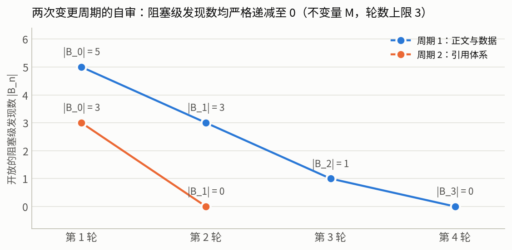

**图 16**：两个变更周期的 $|B_n|$ 曲线，均严格递减至 0，且均未超过协议规定的轮数上限 3。**C1 值得单独记一笔**：一个返回了「相似度 1.0」的模糊匹配，安静地给出了一篇完全不同的论文。如果著录信息是手写的，这个错误根本不会发生——但也不会有任何机制能发现另一种同样容易犯的手写错误。**自动化不消灭错误，它把错误从「随机且不可检」换成「系统且可检」**，前提是你真的去检。

### 9.5 一处必须承认的不符合项

本报告的评审者与作者是同一个主体，因此**不变量 3（reviewer 无轨迹）只做到了结构上的近似而非严格满足**。真实部署中该不变量由独立上下文的 subagent 保证；本报告只能通过「以 verifier 输出与落盘数据为唯一输入重新检查」来逼近它。**这是本报告方法论上最弱的一环，如实记录。**

---

## 10. 局限

**抽样。** D1/D2 只覆盖 5 个大型基础设施类仓库，均为多语言、高流量、有专职维护者的项目；结论不能外推到小型或单人项目。D3 只覆盖 4 个以 App 身份提交 PR 的 agent，`cursor` 与 `codex` 在多数集成模式下以用户身份提交，**结构上不可按作者检索**，因此本报告的 agent 侧样本对当前 agent 生态是有偏的。D3 的 4 处采集缺口进一步造成 agent 间配比不均衡（§3.3）。

**时间截面。** 全部一手数据为 2026-08-04 的单一截面，「最近 100 个 PR」在不同仓库对应的日历跨度差异极大（pytorch 的 100 个 PR 可能只覆盖数天，node 覆盖数周）。因此跨仓库比较的是**同等 PR 数**下的行为，不是同等时间窗内的行为。

**测量。** 三个已知的口径偏差方向已在正文中逐一标注：`pct_zero_formal_review` 因旁路批准而**高估**门禁缺失；`pct_zero_review_and_comment` 因机器人评论而**低估**；`revert_titled` 因标题匹配而**低估**真实回滚率。机械失败判据为正则匹配，只能识别显式自述失败，故实质内容占比 43.55% 为**上界**。

**统计。** 本报告不做假设检验，只报告描述统计与稳健性诊断（留一刀切、宏平均、聚簇占比）。成熟层 n=78 且高度聚簇，任何基于它的推断都不成立，正文已声明。

**文献。** 22 篇全文中，arXiv 条目取 e-print 源码包，个别多文件项目的正文抽取可能不完整，因此「未能定位」的判定存在**假阴性**风险——即某个数值可能确实在原文中而未被检索到。撤销清单因此应读作「本次核对未能确认」，而非「原文中不存在」。

**利益相关性。** 本报告的方案章节大量引用 Claude Code 的官方文档，且报告本身由 Claude Code 生成。对此的部分对冲是：所有产品能力陈述均以官方文档原文为准并注明未涵盖项，所有一手数据独立于任何厂商，且 §7.3 与案例 B 中对 AI reviewer 的负面实测结果被完整保留。**但这不构成充分对冲，读者应据此对 §8 的推荐配置保持独立判断。**

---

## 11. 结论

**一、有穷性是协议属性，不是能力属性。** PR 评审循环没有内生的终止保证（观察 1）；终止必须来自对评审算子的外部约束。人类工程组织用四类装置实现这件事——语义降级、时钟、仲裁、移出本 PR——它们在完全不同的组织里独立收敛到相似形态，且**在过去一年中没有任何变化**。由此得到的推论是「等模型更强」不能解决这个问题：一个无限聪明的评审者，若协议允许它一直提意见，它依然会一直提。

**二、现实中的终止方式主要是超时与放弃，而非收敛。** 已合并的一侧，97.8% 从未出现正式阻塞态、review 提交中位为 1；未合并的一侧，51.2% 从未被 review、22.4% 带生命周期标签、p90 开放 316.6 天。**「改到没意见」在真实数据里根本不是主流路径。** 而允许「带瑕疵合并 + 事后修」的代价，实测约为 0.76% 的回滚率——用约 1% 的回滚换掉绝大多数第 N 轮评审，是一笔极划算的交易。

**三、长 ≠ 不收敛。** 案例 A 用 112 天完成，全程只需 1 次批准、0 次阻塞态，等待主要花在可判定的机器裁决上；案例 B 只用 3.3 天，却包含 20 次空转、4 次回退和一次人工放行。**优化目标应当是消除无界重触发与所有权模糊，而不是压缩总时长。**

**四、当下 AI 评审的问题主要在集成，不在模型。** 实测机器人 review 正文中 56.45% 是机械失败模板（计费失败、配额耗尽），且这种失败在生产环境中静默持续了整整 50 个 PR 无人关闭。同时必须用正确的尺子衡量：人类 reviewer 的评论有用率基线是 64%–68%，不是 100%。

**五、agent 侧唯一稳健的结论是分层的。** 在低成熟度仓库中，agent PR 有约 22% 在既无 review 也无评论的情况下合并，约为人类基线（4.2%–4.6%）的 5 倍；在成熟仓库中，现有样本不足以支持任何方向的跨组比较。**这个结论在本研究过程中被自己的后续数据连续否定了两次**（先是 n=16 的小样本结论被 n=78 推翻，再是 n=78 的按 PR 计数被聚簇诊断判为不可用），这一事实本身是本报告方法可靠性的主要凭据。

**六、落地上不需要造框架。** 成品 harness 已经把四类机制产品化：三级严重度、neutral check run、`REVIEW.md` 最高优先级注入、官方推荐的 re-review convergence / verification bar / nit cap、「回复不触发再生成」，加上 Codex 的 P0/P1-only 与「Leave mechanical checks in CI」。要做的是三件事：**把 verifier 铺满**（它决定评审者能发散的空间上限）、**把 AI review 排在人类 review 之前而非并行**、**把预算与「必须绿」落到 hooks 和 `--max-turns` 这类不可绕过的层**。

---

## 附录 A：数据字典

`derived/tables/` 下的 11 张表均可由 `python3 scripts/analyze.py` 从 `raw/` 完全重算。

| 表 | 内容 | 主要字段 |
|---|---|---|
| `t01_merged_pr_review_structure.csv` | D1 逐仓库的已合并 PR 评审结构 | `pct_zero_changes_requested`、`median_review_submissions`、`p90/max`、`pct_zero_formal_review` |
| `t02_closed_unmerged_pr_structure.csv` | D2 逐仓库的关闭未合并 PR 结构 | `median/p90/max_days_open`、`pct_never_reviewed`、`pct_stale_or_lifecycle_labeled` |
| `t03_agent_pr_by_agent_and_stratum.csv` | D3 逐 agent × 分层 | `pct_zero_formal_review`、`pct_zero_review_and_comment`、`median_minutes_to_merge` |
| `t04_agent_pr_closed_unmerged.csv` | D3 关闭未合并侧 | `median_days_open`、`pct_never_reviewed` |
| `t05_revert_rate.csv` | D4 revert 比例 | `merged_total`、`revert_titled`、`revert_pct` |
| `t06_case_a_label_flow.csv` | 案例 A 的完整标签事件流 | `event`（`+`/`-` 前缀）、`at` |
| `t07_case_b_commits.csv` | 案例 B 的 22 个 commit | `committedDate`、`messageHeadline` |
| `t08_bot_review_signal.csv` | D7 逐 reviewer 的信噪比 | `bodies`、`malfunction`、`substantive_pct` |
| `t09_gate_strength_comparison.csv` | 人类 vs agent 的门禁强度对照 | 两个口径的 `pct_zero_*` |
| `t10_offchannel_approval_decomposition.csv` | 旁路批准归因 | `n_offchannel_approved`、`n_unattributed` |
| `t11_mature_stratum_repo_clustering.csv` | 成熟层的仓库级聚簇 | 逐仓库 `n`、`n_zero_review_and_comment` |

## 附录 B：图目录

| 图 | 内容 | 数据来源 |
|---|---|---|
| fig01 | 已合并 PR 的正式阻塞态次数分布 | t01 |
| fig02 | review 提交数的中位 / p90 / 最大值 | t01 |
| fig03 | 关闭未合并 PR 的开放天数与 stale 标签占比 | t02 |
| fig04 | 门禁缺失率的两个口径对照 | t09 |
| fig05 | agent PR 零 review 合并率的分层对照 | t03 |
| fig06 | agent PR 合并耗时 | stats |
| fig07 | 案例 A 的状态占用时序 | t06 |
| fig08 | 案例 B 的行为者分解 | stats |
| fig09 | 案例 B 中 AI reviewer 的实际产出 | stats |
| fig10 | bot review 的实质内容占比 | t08 |
| fig11 | revert 比例 | t05 |
| fig12 | 文献证据窗口与基准日的关系 | 手工时间轴 + lit |
| fig13 | EIR–ECR 迭代稳定域 | 闭式判据 |
| fig14 | 旁路批准归因分解 | t10 |
| fig15 | 成熟层的仓库级聚簇 | t11 |
| fig16 | 两个变更周期的自审 $\|B_n\|$ 曲线 | `audit/self_review_log.csv` |

## 附录 C：引用本报告

仓库根目录的 [`CITATION.cff`](CITATION.cff) 采用 Citation File Format 1.2.0。GitHub 会解析该文件并在仓库首页右侧渲染 "Cite this repository"，可直接导出 APA 与 BibTeX 两种格式[[29]](#ref-github-citation)。若需在本地转换为其他格式，可用 `cffconvert`。

本报告的可引用单元是**基准日 + 提交哈希**，而非仓库本身：全部数值绑定在 2026-08-04 这一次采集上，重新运行 `scripts/collect.py` 会得到不同的数值。引用时请注明所依据的提交。

---

## 附录 D：参考文献

正文中的引用写作可点击的 `[n]`，链接目标带有文献 key（如 `#ref-sadowski2018`），因此「编号 ↔ 文献」这一映射本身是机器可核对的，由 [`scripts/verify.py`](scripts/verify.py) 检查三件事：正文引用的每个编号与其锚点一致、不存在指向不存在文献的孤儿引用、不存在从未被正文引用的条目。第三方论文全文不随本仓库分发，只提供 URL 与 SHA-256。

<!--REFS:BEGIN-->

共 34 条：学术文献 22 条（全部下载全文核对，校验和见 [`lit/manifest.csv`](lit/manifest.csv)，逐条引文见 [`lit/quotes.md`](lit/quotes.md)），工程惯例与产品文档 12 条（全部于 2026-08-04 回原文逐句复核）。著录信息由 [`scripts/fetch_citation_metadata.py`](scripts/fetch_citation_metadata.py) 自 arXiv 与 DBLP 接口取回并落盘于 [`lit/references.json`](lit/references.json)，本表与 [`references.bib`](references.bib) 均由 [`scripts/gen_references.py`](scripts/gen_references.py) 生成，非手写。

### D.1 学术文献

<a id="ref-2606.13468"></a>**[1]** Mahmoud Abujadallah, Ali Arabat, Mohammed Sayagh. *Understanding the Rejection of Fixes Generated by Agentic Pull Requests -- Insights from the AIDev Dataset*. arXiv:2606.13468 [cs.SE]，2026-06-11. DOI: [10.1145/3793302.3793592](https://doi.org/10.1145/3793302.3793592). e-print 源码包 <https://arxiv.org/e-print/2606.13468>，SHA-256 `60c42d352a5d1480…`（取回于 2026-08-04）。

<a id="ref-bacchelli2013"></a>**[2]** Alberto Bacchelli, Christian Bird. *Expectations, outcomes, and challenges of modern code review*. ICSE 2013. DOI: [10.1109/ICSE.2013.6606617](https://doi.org/10.1109/ICSE.2013.6606617). 全文 <https://sback.it/publications/icse2013.pdf>，SHA-256 `328720358c303075…`（取回于 2026-08-04）。

<a id="ref-bosu2015"></a>**[3]** Amiangshu Bosu, Michaela Greiler, Christian Bird. *Characteristics of Useful Code Reviews: An Empirical Study at Microsoft*. MSR 2015. DOI: [10.1109/MSR.2015.21](https://doi.org/10.1109/MSR.2015.21). 全文 <https://www.microsoft.com/en-us/research/wp-content/uploads/2016/02/bosu2015useful.pdf>，SHA-256 `f8e2cb4e6ecdc4a2…`（取回于 2026-08-04）。

<a id="ref-2604.03196"></a>**[4]** Kowshik Chowdhury, Dipayan Banik, K M Ferdous, Shazibul Islam Shamim. *From Industry Claims to Empirical Reality: An Empirical Study of Code Review Agents in Pull Requests*. arXiv:2604.03196 [cs.SE]，2026-04-03. e-print 源码包 <https://arxiv.org/e-print/2604.03196>，SHA-256 `371904d42df85024…`（取回于 2026-08-04）。

<a id="ref-2604.24450"></a>**[5]** Syeda Kaneez Fatima, Yousuf Abrar, Abdul Rehman Tahir, Amelia Nawaz, Shamsa Abid, Abdul Ali Bangash. *On the Footprints of Reviewer Bots Feedback on Agentic Pull Requests in OSS GitHub Repositories*. arXiv:2604.24450 [cs.SE]，2026-04-27. DOI: [10.1145/3793302.3793599](https://doi.org/10.1145/3793302.3793599). e-print 源码包 <https://arxiv.org/e-print/2604.24450>，SHA-256 `8e78f47afefd8ed4…`（取回于 2026-08-04）。

<a id="ref-gousios2015"></a>**[6]** Georgios Gousios, Andy Zaidman, Margaret-Anne D. Storey, Arie van Deursen. *Work Practices and Challenges in Pull-Based Development: The Integrator's Perspective*. ICSE 2015. DOI: [10.1109/ICSE.2015.55](https://doi.org/10.1109/ICSE.2015.55). 全文 <https://azaidman.github.io/publications/gousiosICSE2015.pdf>，SHA-256 `2a04fcae26d94002…`（取回于 2026-08-04）。

<a id="ref-gousios2016"></a>**[7]** Georgios Gousios, Margaret-Anne D. Storey, Alberto Bacchelli. *Work practices and challenges in pull-based development: the contributor's perspective*. ICSE 2016. DOI: [10.1145/2884781.2884826](https://doi.org/10.1145/2884781.2884826). 全文 <https://sback.it/publications/icse2016b.pdf>，SHA-256 `c962df1e01f1296e…`（取回于 2026-08-04）。

<a id="ref-2607.01641"></a>**[8]** Xinyi Hou, Shenao Wang, Yanjie Zhao, Haoyu Wang. *When Agents Do Not Stop: Uncovering Infinite Agentic Loops in LLM Agents*. arXiv:2607.01641 [cs.SE]，2026-07-02. e-print 源码包 <https://arxiv.org/e-print/2607.01641>，SHA-256 `bcc15efca29ac61e…`（取回于 2026-08-04）。

<a id="ref-2310.01798"></a>**[9]** Jie Huang, Xinyun Chen, Swaroop Mishra, Huaixiu Steven Zheng, Adams Wei Yu, Xinying Song, 等. *Large Language Models Cannot Self-Correct Reasoning Yet*. arXiv:2310.01798 [cs.CL]，2023-10-03（最后修订 2024-03-14）. e-print 源码包 <https://arxiv.org/e-print/2310.01798>，SHA-256 `5ecc62e5807453d5…`（取回于 2026-08-04）。

<a id="ref-2605.17548"></a>**[10]** Hüseyin Özgür Kamalı, Erdem Tuna, Vahid Haratian, Eray Tüzün. *Rethinking Code Review in the Age of AI: A Vision for Agentic Code Review*. arXiv:2605.17548 [cs.SE]，2026-05-17（最后修订 2026-06-05）. e-print 源码包 <https://arxiv.org/e-print/2605.17548>，SHA-256 `f4a6f6f9ddf807b9…`（取回于 2026-08-04）。

<a id="ref-2602.09185"></a>**[11]** Hao Li, Haoxiang Zhang, Ahmed E. Hassan. *AIDev: Studying AI Coding Agents on GitHub*. arXiv:2602.09185 [cs.SE]，2026-02-09. DOI: [10.1145/3793302.3797249](https://doi.org/10.1145/3793302.3797249). e-print 源码包 <https://arxiv.org/e-print/2602.09185>，SHA-256 `c565e5ce56c7e143…`（取回于 2026-08-04）。

<a id="ref-2607.03316"></a>**[12]** Hong Yi Lin, Mingzhao Liang, Patanamon Thongtanunam, Kla Tantithamthavorn. *Is Agentic Code Review Helpful? Mining Developers' Feedback to CodeRabbit Reviews in the Wild*. arXiv:2607.03316 [cs.SE]，2026-07-03（最后修订 2026-07-23）. e-print 源码包 <https://arxiv.org/e-print/2607.03316>，SHA-256 `91d81b5e9e229c73…`（取回于 2026-08-04）。

<a id="ref-2604.22273"></a>**[13]** Aofan Liu, Jingxiang Meng. *Self-Correction as Feedback Control: Error Dynamics, Stability Thresholds, and Prompt Interventions in LLMs*. arXiv:2604.22273 [cs.AI]，2026-04-24（最后修订 2026-05-04）. e-print 源码包 <https://arxiv.org/e-print/2604.22273>，SHA-256 `312bfe4480e140f7…`（取回于 2026-08-04）。

<a id="ref-2303.17651"></a>**[14]** Aman Madaan, Niket Tandon, Prakhar Gupta, Skyler Hallinan, Luyu Gao, Sarah Wiegreffe, 等. *Self-Refine: Iterative Refinement with Self-Feedback*. arXiv:2303.17651 [cs.CL]，2023-03-30（最后修订 2023-05-25）. e-print 源码包 <https://arxiv.org/e-print/2303.17651>，SHA-256 `b13ddd82b7c55224…`（取回于 2026-08-04）。

<a id="ref-2407.04549"></a>**[15]** Jane Pan, He He, Samuel R. Bowman, Shi Feng. *Spontaneous Reward Hacking in Iterative Self-Refinement*. arXiv:2407.04549 [cs.CL]，2024-07-05. e-print 源码包 <https://arxiv.org/e-print/2407.04549>，SHA-256 `74ba5d18720bdfd7…`（取回于 2026-08-04）。

<a id="ref-2602.08915"></a>**[16]** Giovanni Pinna, Jingzhi Gong, David Williams, Federica Sarro. *Comparing AI Coding Agents: A Task-Stratified Analysis of Pull Request Acceptance*. arXiv:2602.08915 [cs.SE]，2026-02-09（最后修订 2026-05-07）. e-print 源码包 <https://arxiv.org/e-print/2602.08915>，SHA-256 `82df4aac010c8142…`（取回于 2026-08-04）。

<a id="ref-rigby2013"></a>**[17]** Peter C. Rigby, Christian Bird. *Convergent contemporary software peer review practices*. ESEC/FSE 2013. DOI: [10.1145/2491411.2491444](https://doi.org/10.1145/2491411.2491444). 全文 <https://www.microsoft.com/en-us/research/wp-content/uploads/2016/02/rigby2013convergent.pdf>，SHA-256 `68e2faff6ff924e2…`（取回于 2026-08-04）。

<a id="ref-sadowski2018"></a>**[18]** Caitlin Sadowski, Emma Söderberg, Luke Church, Michal Sipko, Alberto Bacchelli. *Modern code review: a case study at google*. ICSE 2018. DOI: [10.1145/3183519.3183525](https://doi.org/10.1145/3183519.3183525). 全文 <https://sback.it/publications/icse2018seip.pdf>，SHA-256 `299c18e1da4dc75f…`（取回于 2026-08-04）。

<a id="ref-thongtanunam2016"></a>**[19]** Patanamon Thongtanunam, Shane McIntosh, Ahmed E. Hassan, Hajimu Iida. *Review participation in modern code review - An empirical study of the android, Qt, and OpenStack projects*. Empirical Software Engineering 2017. DOI: [10.1007/S10664-016-9452-6](https://doi.org/10.1007/S10664-016-9452-6). 全文 <https://sailresearch.github.io/sail-website/data/pdfs/EMSE2016_ReviewParticipationInModernCodeReviewAnEmpiricalStudyOfTheAndroidQtAndOpenStackProjects.pdf>，SHA-256 `53706eae8ecdf994…`（取回于 2026-08-04）。

<a id="ref-2402.11436"></a>**[20]** Wenda Xu, Guanglei Zhu, Xuandong Zhao, Liangming Pan, Lei Li, William Yang Wang. *Pride and Prejudice: LLM Amplifies Self-Bias in Self-Refinement*. arXiv:2402.11436 [cs.CL]，2024-02-18（最后修订 2024-06-18）. e-print 源码包 <https://arxiv.org/e-print/2402.11436>，SHA-256 `deae9fd16580e4af…`（取回于 2026-08-04）。

<a id="ref-yu2015"></a>**[21]** Yue Yu, Huaimin Wang, Vladimir Filkov, Premkumar T. Devanbu, Bogdan Vasilescu. *Wait for It: Determinants of Pull Request Evaluation Latency on GitHub*. MSR 2015. DOI: [10.1109/MSR.2015.42](https://doi.org/10.1109/MSR.2015.42). 全文 <https://yuyue.github.io/res/paper/msr2015.pdf>，SHA-256 `0d2001b86af7663c…`（取回于 2026-08-04）。

<a id="ref-2606.22721"></a>**[22]** Haoran Yu, Lifei Liu, Xiaochong Jiang, Yuwen Jia, Su Wang, Pin Qian, 等. *Habituation at the Gate: Rising Approval and Declining Scrutiny in Human Review of AI Agent Code*. arXiv:2606.22721 [cs.SE]，2026-06-21. e-print 源码包 <https://arxiv.org/e-print/2606.22721>，SHA-256 `74389dd168e404ca…`（取回于 2026-08-04）。


### D.2 工程惯例与产品文档

<a id="ref-apache-voting"></a>**[23]** The Apache Software Foundation. *Apache Voting Process*. apache.org. <https://www.apache.org/foundation/voting.html>（访问日期 2026-08-04）。本报告所引措辞已于该日期回原文逐句复核。

<a id="ref-cc-code-review"></a>**[24]** Anthropic. *Code Review*. Claude Code Documentation. <https://code.claude.com/docs/en/code-review>（访问日期 2026-08-04）。本报告所引措辞已于该日期回原文逐句复核。

<a id="ref-cc-github-actions"></a>**[25]** Anthropic. *Claude Code GitHub Actions*. Claude Code Documentation. <https://code.claude.com/docs/en/github-actions>（访问日期 2026-08-04）。本报告所引措辞已于该日期回原文逐句复核。

<a id="ref-cc-hooks"></a>**[26]** Anthropic. *Hooks Reference*. Claude Code Documentation. <https://code.claude.com/docs/en/hooks>（访问日期 2026-08-04）。本报告所引措辞已于该日期回原文逐句复核。

<a id="ref-codex-github"></a>**[27]** OpenAI. *Codex GitHub Integration*. OpenAI Codex Documentation. <https://learn.chatgpt.com/codex/third-party/github>（访问日期 2026-08-04）。本报告所引措辞已于该日期回原文逐句复核。

<a id="ref-codex-review-usecase"></a>**[28]** OpenAI. *GitHub Code Reviews*. OpenAI Codex Documentation. <https://learn.chatgpt.com/use-cases/github-code-reviews>（访问日期 2026-08-04）。本报告所引措辞已于该日期回原文逐句复核。

<a id="ref-github-citation"></a>**[29]** GitHub. *About CITATION files*. GitHub Docs. <https://docs.github.com/en/repositories/managing-your-repositorys-settings-and-features/customizing-your-repository/about-citation-files>（访问日期 2026-08-04）。本报告所引措辞已于该日期回原文逐句复核。

<a id="ref-gitlab-review"></a>**[30]** GitLab. *Code Review Guidelines*. GitLab Development Documentation. <https://docs.gitlab.com/development/code_review/>（访问日期 2026-08-04）。本报告所引措辞已于该日期回原文逐句复核。

<a id="ref-google-standard"></a>**[31]** Google. *The Standard of Code Review*. Google Engineering Practices. <https://google.github.io/eng-practices/review/reviewer/standard.html>（访问日期 2026-08-04）。本报告所引措辞已于该日期回原文逐句复核。

<a id="ref-k8s-pr"></a>**[32]** Kubernetes Project. *Pull Requests*. kubernetes.dev Contributor Guide. <https://www.kubernetes.dev/docs/guide/pull-requests/>（访问日期 2026-08-04）。本报告所引措辞已于该日期回原文逐句复核。

<a id="ref-nodejs-collaborator"></a>**[33]** Node.js Project. *Collaborator Guide*. nodejs/node. <https://github.com/nodejs/node/blob/main/doc/contributing/collaborator-guide.md>（访问日期 2026-08-04）。本报告所引措辞已于该日期回原文逐句复核。

<a id="ref-rfcbot"></a>**[34]** rust-lang. *rfcbot-rs*. GitHub. <https://github.com/rust-lang/rfcbot-rs>（访问日期 2026-08-04）。本报告所引措辞已于该日期回原文逐句复核。

<!--REFS:END-->


